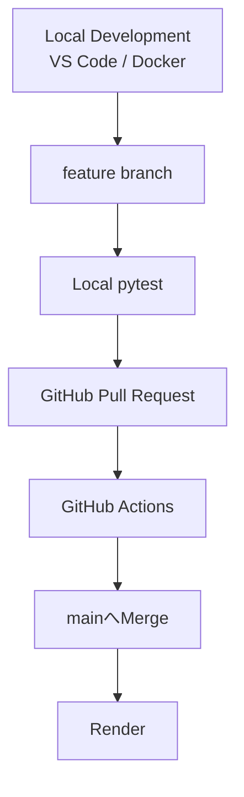

# 🍞 Bakery Sales Management System


> **現場の「困った」を、Pythonで「最適解」へ。**

ベーカリーの商品登録・日次売上入力・売上分析を一元管理し、  
Gemini APIによる経営アドバイスまで支援するWebアプリケーションです。

販売・飲食・物流の現場経験とWebデザインの知識をもとに、

**老若男女が迷わず操作でき、ヒューマンエラーを仕組みで防ぐ、現場目線の業務システム**

を目指して開発しています。

---

## 🚀 オンラインデモ

### [👉 ベーカリー売上管理システムを体験する](https://bakery-salesdata.onrender.com/)

スマートフォン・PCのブラウザからアクセスできます。

現在は、管理者アカウントを公開せずに実際の業務画面を操作できる  
**Guest Demo** を公開しています。

ログイン画面の

```text
ゲストデモを始める
```

から体験できます。

Guest Demoでも、

```text
商品を登録する
      ↓
日次売上を入力する
      ↓
売上ランキング・グラフを見る
      ↓
Geminiへ経営アドバイスを依頼する
```

という実際の業務フローを操作できます。

> [!NOTE]
> Renderの無料インスタンスを使用しているため、しばらくアクセスがない場合はスリープ状態になります。  
> 最初のアクセス時のみ、起動に時間がかかる場合があります。

### Guest Demoの主な制限

```text
Guestごとに専用Datasetを作成
他Guest・Adminのデータとは分離

無操作30分で期限切れ
開始から最大2時間

AI機能
1 Guest Datasetにつき合計3回まで

Guestの商品数
1 Datasetにつき最大30件

1回のProduct / Sales POST
最大30件

同時に存在できる有効Guest
最大10件
```

> [!WARNING]
> Guest Dataset同士、およびAdmin Datasetとは分離していますが、  
> 本システムは実店舗向けの複数ユーザー・複数店舗サービスとして運用しているものではありません。
>
> 公開環境へ個人情報・機密情報・実際の店舗データを入力しないでください。

---

## 📸 スクリーンショット

> スクリーンショットは撮影時点の画面です。  
> 現在の実装では、Guest Demo、Dataset分離、認証、CSRF保護、rate limit、回帰テストなどを追加しています。

### 🍞 商品マスタ登録画面

[](https://raw.githubusercontent.com/tosane932/sales_data_app/main/screenshot/screen01.jpg)

### ✅ メニュー登録完了画面

[](https://raw.githubusercontent.com/tosane932/sales_data_app/main/screenshot/screen02.jpg)

### 📝 日次売上入力画面

[](https://raw.githubusercontent.com/tosane932/sales_data_app/main/screenshot/screen03.jpg)

### 📊 売上分析ダッシュボード

[](https://raw.githubusercontent.com/tosane932/sales_data_app/main/screenshot/screen04.jpg)

[](https://raw.githubusercontent.com/tosane932/sales_data_app/main/screenshot/screen05.jpg)

[](https://raw.githubusercontent.com/tosane932/sales_data_app/main/screenshot/screen06.jpg)

---

## 📺 デモ動画

以下の画像をクリックすると、YouTubeで実際の動作を確認できます。

[](https://youtu.be/iz4r3YP3JZk?si=w9AENw1iifjlwZ7j)

> デモ動画は撮影時点の画面です。  
> 最新版ではGuest DemoやDataset分離を含め、認証・セキュリティ・回帰テストを大幅に強化しています。

---

## 📖 プロジェクト概要

ベーカリー店舗の日々の商品管理・売上入力・分析を一元化するWebアプリケーションです。

現在は、次の2種類の利用者を明確に分けています。

```text
/login
  │
  ├── Admin
  │     └── 管理者専用Dataset
  │
  └── Guest Demo
        └── Guestごとの一時Dataset
```

AdminとGuestは同じ業務画面を利用できますが、  
参照・更新するデータは認証されたidentityからサーバー側で決定します。

利用者が外部から任意の`dataset_id`を指定して、別Datasetへ切り替える設計にはしていません。

### 基本の業務フロー

```text
ログイン / Guest Demo開始
        ↓
商品メニューと価格を登録する
        ↓
本日の販売個数を入力・更新する
        ↓
売上ランキングとグラフを確認する
        ↓
必要なときだけGeminiへ経営アドバイスを依頼する
```

単に機能を実装するだけではなく、

**「忙しい現場でも迷わず操作でき、事故につながる状態をシステム側で防ぐ」**

ことを重視しています。

---

## ✨ 技術的な見どころ

- PostgreSQL / SQLAlchemyによるデータ永続化
- Flask-Migrate / AlembicによるDB変更管理
- DatasetによるAdmin / Guest / Guest間のデータ分離
- Guest Sessionの無操作30分・絶対2時間の期限管理
- 期限切れGuest Datasetと関連データのcleanup
- Guest Dataset単位のGemini API合計3回制限
- Guest Session作成rate limit
- 有効Guest Dataset最大10件
- Guestの商品数・POST件数制限
- PostgreSQL上の並行requestを考慮したlock制御
- Flask-LoginによるAdmin認証
- Session fingerprintによる認証設定変更時のfail-closed
- Adminログイン失敗5回 / 15分のrate limit
- Flask-WTF / CSRFProtect
- XSS対策と回帰テスト
- Session CookieのSecure / HttpOnly / SameSite設定
- Security Headers / HSTS
- GitHub ActionsによるCI
- Falsification / Manual Mutation Testing
- 月替わり・年替わり事故の回帰テスト
- 現在のpytest結果：**378 passed / 4 skipped**

---

## 📊 3ステップで体験する業務フロー

### 1. 商品メニューと価格を登録する

対象月の商品名と価格を登録します。

登録済み商品については、商品IDを基準に名称・価格を更新します。

販売終了商品は物理削除せず、

```text
is_active = False
```

とする論理削除方式です。

これにより、販売終了後も過去の売上履歴を維持できます。

Guest Demoでは、1 Datasetにつき最大30商品まで登録できます。

---

### 2. 本日の販売個数を入力・更新する

日次売上入力画面では、商品ごとに現在保存されている数量を表示します。

```text
高級食パン
🟢 本日の登録済み：14個
```

入力欄にも現在値を表示します。

14個登録済みの商品へ17個を入力した場合、

```text
14 + 17 = 31
```

ではなく、

```text
14 → 17
```

と更新します。

そこで画面上でも、

```text
💾 本日の売上個数を更新する
```

と表現しています。

また、入力欄へフォーカスした際には現在値を選択状態にし、

```text
30
↓
35を入力
↓
35
```

となるよう、既存値を削除する手間を減らしています。

---

### 3. 売上分析・ランキングを見る

ダッシュボードでは、

- 商品別売上ランキング
- 売上数量グラフ
- 年月別集計
- 販売終了商品の過去売上
- Gemini APIによる経営改善提案

などを確認できます。

売上データが存在する月には、

```text
✅
```

を表示します。

この✅は、

```text
商品が登録されている月
```

ではなく、

```text
DailySalesが存在する月
```

を示します。

表示年月を変更した場合は、

```text
🔍 データを抽出
```

を押してDashboardを更新します。

---

## ⚙️ 主な機能

| 分類 | 機能 |
|---|---|
| Admin認証 | Flask-Login・password hash・Session fingerprint |
| Guest Demo | 認証情報不要の一時体験環境 |
| Dataset分離 | Admin / Guest / Guest間のデータ境界 |
| Guest期限 | 無操作30分・絶対2時間 |
| Guest cleanup | 期限切れDatasetと関連データの削除 |
| Guest作成制御 | rate limit・有効Guest最大10件 |
| 商品上限 | Guest 1 Dataset最大30商品 |
| POST制限 | Guest Product / Sales最大30件 |
| Admin rate limit | ログイン失敗5回 / 15分 |
| CSRF | Flask-WTF / CSRFProtect |
| Session Cookie | Secure・HttpOnly・SameSite=Lax |
| Security Header | HSTS・X-Frame-Optionsなど |
| 商品管理 | 月別商品登録・名称・価格更新 |
| 販売終了 | `is_active`による論理削除 |
| 日次売上 | 商品別販売数・同日データ上書き |
| 状態表示 | 現在の登録済み個数を表示 |
| 売上分析 | 年月別集計・ランキング・グラフ |
| AI | Gemini APIによる日次支援・経営アドバイス |
| AI制限 | Guest Dataset単位で合計3回 |
| DB整合性 | 一意制約・transaction・rollback |
| XSS対策 | DOM API・Jinja2 autoescape |
| Migration | Flask-Migrate / Alembic |
| CI | GitHub Actions |
| テスト | pytest・Falsification・Manual Mutation Testing |

---

## 🛠 技術スタック

### Backend

- Python 3.12
- Flask 3.1
- SQLAlchemy
- Flask-Migrate
- Alembic
- Flask-Login
- Flask-WTF
- Werkzeug
- Gunicorn

### Frontend

- HTML
- CSS
- JavaScript
- Jinja2
- Fetch API
- Chart.js

### Database

- PostgreSQL
- SQLite（ローカル開発・通常テスト）

### AI

- Google Gemini API
- Google GenAI SDK
- Prompt Engineering

### Infrastructure

- Docker
- Docker Compose
- Render
- Git
- GitHub
- GitHub Actions

### Quality / Security

- pytest
- Falsification
- Manual Mutation Testing
- CSRF Protection
- XSS Regression Testing
- Dataset Isolation Testing
- Migration Testing
- Security Header Testing
- PostgreSQL Integration Testing

---

## 📚 詳細な設計・実装内容

以下の項目は、見出しをクリックすると展開できます。

---

<details>
<summary><strong>🗂 DatasetによるAdmin / Guest分離を見る</strong></summary>

<br>

Guest Demo公開にあたり、`Dataset`をデータ境界として導入しました。

```text
Dataset
├── Admin Dataset
├── Guest Dataset A
├── Guest Dataset B
└── Guest Dataset C
```

Productは所属する`dataset_id`を持ちます。

商品・日次売上・Dashboard・AI分析などの処理では、  
現在認証されている利用者が利用できるDatasetだけを対象にします。

```text
Guest A
↓
Guest Bの商品・売上を参照しない

Guest
↓
Adminの商品・売上を参照しない
```

Guest AからGuest Bの商品IDを送信した場合でも、  
現在のDatasetに所属する商品として解決できなければ更新処理へ進みません。

Dashboardについても、

```text
HTML表示
API集計
売上存在月
ランキング
AI prompt
```

までDataset単位で絞り込みます。

外部から`dataset_id`を送信して対象Datasetを切り替える方式ではなく、  
認証済みidentityからサーバー側でDatasetを決定します。

既存のAdminデータについては、Alembic migrationを利用して、

```text
Datasetテーブル追加
↓
Admin Dataset作成
↓
既存ProductをAdmin Datasetへbackfill
↓
Product.dataset_idをNOT NULL化
```

という段階的な移行を行いました。

> [補足]
> 一般的な複数ユーザー・複数店舗向けtenant機能を完成させたという意味ではありません。  
> 現在は単一Adminと一時Guest Datasetを分離する構成です。

</details>

---

<details>
<summary><strong>⏱ Guest Datasetの期限・cleanupを見る</strong></summary>

<br>

Guest Datasetでは主に、

```text
created_at
last_activity_at
absolute_expires_at
```

を管理します。

現在の期限は、

```text
無操作期限
30分

絶対期限
2時間
```

です。

無操作期限は利用中の活動によって更新されますが、  
絶対期限は延長しません。

Guest Datasetの利用時には期限を確認し、期限切れの場合は業務処理へ進ませません。

さらに新しいGuest Session作成時には、期限切れGuest Datasetをcleanupします。

削除順序は、

```text
DailySales
      ↓
Product
      ↓
Dataset
```

です。

Admin Datasetや有効Guest Datasetはcleanup対象へ含めません。

### cleanup競合対策

最初の期限判定時には期限切れだったGuestでも、  
削除直前までに利用者が操作して`last_activity_at`が更新される可能性があります。

そこで削除候補をそのまま信用せず、

```text
期限切れ候補を取得
↓
削除直前に最新rowを再取得
↓
row lock
↓
期限を再判定
↓
まだ期限切れなら削除
```

という流れにしています。

これにより、

```text
最初は無操作30分超過
↓
利用者が操作して活動時刻更新
↓
古い判定だけを使って削除
```

という事故を防ぎます。

次のようなケースもテストしています。

- 絶対期限切れ
- 無操作期限切れ
- 境界時刻
- 有効Guest保持
- Admin保持
- cleanup冪等性
- cleanup途中のDBエラーとrollback
- 同時cleanup
- cleanupとGuest活動の競合

</details>

---

<details>
<summary><strong>🤖 Gemini API・Guest AI利用制限を見る</strong></summary>

<br>

Gemini APIはページ表示だけでは実行しません。

```text
日次売上入力
└── 今日のひとことを聞く

Dashboard
└── 詳しいアドバイスを聞く
```

利用者が明示的に操作したときだけAPIを呼び出します。

Guest Demoでは、

```text
/api/greeting
+
/api/ai-advice
=
合計3回
```

まで利用できます。

1 Guest Datasetごとに独立した回数を管理します。

```text
Guest A
3回

Guest B
3回
```

のように、別Guestの利用回数は混ざりません。

4回目以降はHTTP 429を返し、Gemini APIへ進みません。

### atomicな利用権確保

単純な、

```text
SELECT
↓
Pythonで回数確認
↓
+1
```

では、同時request時に上限を超える可能性があります。

そこでDB側で条件付きUPDATEを行い、

```text
guest_ai_usage_count < 3
期限内
現在のGuest Dataset
```

を満たした場合だけ1回分の利用権を確保します。

commit後にGemini APIを呼び出すため、  
Geminiの応答待ち中にDB transactionを保持し続けない構成です。

Gemini API側で、

```text
429
503
timeout
その他のAPIエラー
```

が発生した場合でも、すでに確保した利用回数は戻しません。

一方、

```text
API Keyがない
対象売上データがない
Geminiを呼び出さないfallback
```

では回数を消費しません。

### Guest prompt上限

公開Demoから送信されるAI promptが無制限に大きくならないよう、  
GuestのAI adviceでは対象Datasetの売上を集計したうえで上位商品数を制限しています。

商品名や数量についても送信前に再検証します。

AI APIはPOSTとして扱い、CSRF保護も適用しています。

</details>

---

<details>
<summary><strong>🚧 Guest Demoの公開防御を見る</strong></summary>

<br>

公開Demoでは、

```text
機能が正常に動く
```

だけではなく、

```text
大量アクセスされたら？
同時requestされたら？
上限を回避されたら？
```

という前提でも確認しています。

### Guest Session作成rate limit

Guest Session作成にはclient単位のrate limitを設定しています。

client識別では、生IPそのものをDBへ保存せず、  
HMAC-SHA256で匿名化したkeyを使用します。

```text
Client IP
↓
検証・正規化
↓
HMAC-SHA256
↓
匿名client key
```

rate limitの利用回数はGuest Dataset作成前に確保します。

そのため、後段でDataset作成に失敗した場合でも、  
確保済みの利用回数を戻して大量試行を許可することはしません。

設定不備・client情報不備・DB障害時は安全側へ倒し、Guest作成を拒否します。

### 有効Guest Dataset数

同時に存在できる有効Guest Datasetは既定値で最大10件です。

Guest開始時には、

```text
cleanup
↓
現在の有効Guest数を確認
↓
上限未満なら新規Dataset作成
```

という順で処理します。

PostgreSQLではadvisory lockを利用し、  
複数requestが同時に「まだ空きがある」と判断する競合を抑えています。

### 商品・POST上限

Guestでは、

```text
1 Datasetあたりの商品総数
最大30

1回のProduct POST
最大30件

1回のSales POST
最大30件
```

としています。

論理削除した商品もGuest Datasetの生涯商品数として数えるため、  
削除と再登録を繰り返して無制限にデータを増やすことを防ぎます。

既存Productの更新や論理削除自体は、新規商品枠を消費しません。

同時Product POSTについてもPostgreSQL上で上限を超えないことを確認しています。

</details>

---

<details>
<summary><strong>🔐 Admin認証・Session・rate limitを見る</strong></summary>

<br>

管理者側はFlask-Loginによる単一管理者方式です。

認証情報は環境変数から取得します。

```text
SECRET_KEY
ADMIN_USERNAME
ADMIN_PASSWORD_HASH
```

平文passwordをコード内へ保存せず、Werkzeugのpassword hashを利用します。

### Session fingerprint

ログイン時には現在の`ADMIN_PASSWORD_HASH`からfingerprintを生成し、Sessionへ保存します。

```text
ログイン時
↓
現在の認証設定からfingerprint生成
↓
Sessionへ保存
```

Session復元時には、

```text
現在の認証設定
↓
fingerprint生成
↓
Session内のfingerprintと比較
```

します。

次の場合は既存Sessionを認証済みとして扱いません。

```text
fingerprintが存在しない
fingerprintが一致しない
管理者設定が不足
password hashが無効
```

これにより、管理者password hash変更後に古いSessionが残り続ける状態を防ぎます。

### Admin login rate limit

管理者ログイン失敗には、

```text
5回 / 15分
```

のrate limitを設定しています。

```text
1〜5回目
HTTP 401

6回目以降
HTTP 429
```

上限到達中は、正しい認証情報を送信した場合でも429として扱います。

また、

```text
wrong username
wrong password
```

によって外部レスポンスを変えません。

Guest作成rate limitとは別のHMAC domain・counterを使用しています。

PostgreSQLでは、同一clientの、

```text
上限確認
↓
credential検証
↓
成功判定
↓
失敗counter更新
```

を直列化し、並行requestによるrate limitすり抜けも検証しています。

</details>

---

<details>
<summary><strong>🛡 CSRF・XSS・Security Headersを見る</strong></summary>

<br>

### CSRF保護

Flask-WTFの`CSRFProtect`を利用しています。

状態を変更するPOSTやAI APIについて、CSRF tokenを確認します。

```text
tokenなし
↓
HTTP 400

改ざんtoken
↓
HTTP 400
```

拒否された場合に、

- Admin Sessionが作成されない
- Guest Datasetが作成されない
- Productが変更されない
- DailySalesが変更されない
- Guest AI利用回数を消費しない
- Gemini APIを呼び出さない

こともテストしています。

### XSS対策

動的ランキングやAI返答表示では、

```javascript
document.createElement()
textContent
createTextNode()
replaceChildren()
innerText
```

などを利用します。

未信頼データをHTMLとして解釈する処理を避けています。

Jinja2による初期表示についてもautoescapeを利用します。

回帰テストでは、

```text
innerHTML
outerHTML
insertAdjacentHTML
```

などのHTML sinkが重要な商品名表示処理へ混入していないかも確認しています。

### Session Cookie

Session Cookieでは、

```text
Secure
HttpOnly
SameSite=Lax
```

を設定しています。

ローカルHTTP開発では、環境変数によって`Secure`を無効化できるよう、本番設定と分離しています。

### Security Headers

主に次のHeaderを追加しています。

```text
X-Content-Type-Options: nosniff

Referrer-Policy:
strict-origin-when-cross-origin

Permissions-Policy:
camera=(), microphone=(), geolocation=()

X-Frame-Options:
DENY

Strict-Transport-Security:
max-age=86400
```

CSPについても限定的なポリシーから導入しています。

```text
frame-ancestors 'none'
base-uri 'self'
object-src 'none'
form-action 'self'
```

強い`script-src` / `style-src`などは、既存Frontendへの影響を確認しながら段階的に強化する方針です。

</details>

---

<details>
<summary><strong>🧪 pytestを「事故防止台帳」として育てた記録を見る</strong></summary>

<br>

このプロジェクトでは、pytestの件数そのものより、

> **一度見つけた事故やヒヤリハットを、次から自動的に止めること**

を重視しています。

最初は3件だったpytestを段階的に拡充しました。

```text
開始時
3 passed

第1段階
9 passed

第2段階
51 passed

第3段階
69 passed

第4段階
87 passed

第5段階
91 passed

Dataset / Guest Demo実装
↓
200件超

公開Guest入口・公開防御
↓
300件超

現在
378 passed / 4 skipped
```

現在は、

```text
Product
DailySales
Dashboard
AI
XSS
Admin認証
Session fingerprint
CSRF
Authorization
Migration
Dataset分離
Guest identity
Guest Session
Guest期限
cleanup
cleanup競合
Guest AI利用上限
Guest作成rate limit
有効Guest数上限
商品数上限
並行Product POST
AI prompt制限
Admin login rate limit
並行Admin login
Security Headers
HSTS
月替わり
年替わり
```

などを対象にしています。

### PostgreSQL専用テスト

通常suiteでskipされる4件は、テスト用PostgreSQL環境が必要なintegration testです。

通常のSQLiteテストだけで、

```text
PostgreSQL上でも並行性が安全
```

とは扱わず、必要な機能については使い捨てPostgreSQL環境で実際の並行requestを検証しています。

対象には、

- Guest cleanup競合
- Guest有効数上限
- Guest商品数上限
- Admin login rate limit

などがあります。

</details>

---

<details>
<summary><strong>📅 月替わり・年替わり事故の再発防止を見る</strong></summary>

<br>

2026年9月への月替わり時に、8月固定だったテストデータと、

```python
today.month
today.year
```

を利用するproduction codeの条件が一致しなくなり、pytestがREDになりました。

問題の原因はproduction codeの不具合ではなく、

```text
テストデータ側が2026年8月固定
```

だったことです。

単純に9月へ書き換えるだけでは、翌月に同じ事故が再発します。

そこで、

```text
現在日付からテストデータを作成
```

する形へ修正しました。

さらに事故そのものを回帰テストへ残すため、

```text
2026-09-01
```

へ日時を固定する月替わりテストと、

```text
2027-01-01
```

へ固定する年替わりテストを追加しました。

一時的に、

```python
month=today.month
```

を削除すると月替わりテストがREDになり、

```python
year=today.year
```

を削除すると年替わりテストがREDになることも確認しています。

そのため、

```text
テストが存在する
```

だけではなく、

```text
本当にmonth / year条件の欠落を検出できる
```

ことまで確認しています。

</details>

---

<details>
<summary><strong>🧬 Falsification / Manual Mutation Testingを見る</strong></summary>

<br>

pytestがGREENでも、

```text
重要条件を本当に検出できているのか？
```

を確認するため、代表的な条件を意図的に壊すManual Mutation Testingを行いました。

初回検証では、

```text
KILLED
6件

SURVIVED
5件
```

でした。

SURVIVEDした条件を分析し、fixtureやassertionを強化しました。

主な例は、

```text
AI年月filter
↓
前年同月データをfixtureへ追加

Admin Session
↓
fingerprint欠落状態を再現

売上更新
↓
同一商品の別日売上を追加

XSS
↓
安全なAPIの存在だけでなくHTML sink混入を検知

初期ランキング
↓
Jinja2 autoescapeを実表示経路で確認
```

です。

その後、同じ条件を再び壊し、

```text
選択した11 Mutation
↓
すべてRED
```

になることを確認しました。

> [!NOTE]
> アプリ全体のMutation Score 100%を意味するものではありません。  
> 重要な仕様を代表する11条件を手動で選択して検証したものです。

</details>

---

<details>
<summary><strong>🗄 Migration・既存データ移行を見る</strong></summary>

<br>

Flask-Migrate / Alembicを利用してDB構造の変更履歴を管理しています。

途中からmigrationを導入したことで、過去には、

```text
空DB
↓
flask db upgrade
↓
productsテーブルが存在しない
```

という問題が発生しました。

そこで基礎revisionを追加し、

```text
空DB
↓
Alembic base
↓
upgrade
↓
head
```

まで構築できる状態へ修復しました。

pytestでも、

- 必要table
- 必要column
- Alembic revision
- 一意制約

などを自動確認します。

### Dataset導入時のmigration

Guest Demo実装時には、既存Adminデータを失わないよう、

```text
datasetsテーブル追加
↓
products.dataset_idをNULL可で追加
↓
Admin Dataset作成
↓
既存Productをbackfill
↓
外部キー・INDEX追加
↓
NULL / orphan確認
↓
dataset_idをNOT NULL化
```

という段階で移行しました。

migration前後で、

```text
Product件数
Product ID
DailySales件数
DailySales ID
```

が維持されていることも検証しています。

Guest AI利用回数やGuest rate limitについても、必要なschema変更はAlembic revisionとして管理しています。

</details>

---

<details>
<summary><strong>🎨 UI設計・ヒューマンエラー防止を見る</strong></summary>

<br>

本アプリでは、

```text
利用者が注意すれば間違えない
```

ではなく、

```text
注意しなくても間違えにくい
```

画面を目指しています。

### 現在値を表示する

日次売上画面では、

```text
今日この商品を入力したか？
現在何個なのか？
入力すると加算されるのか？
```

という迷いを減らすため、現在の登録値を表示します。

```text
高級食パン

🟢 本日の登録済み：14個
```

入力欄にも同じ14を表示します。

### 「保存」と「更新」を区別する

同じ商品・同じ日付へ再入力した場合は、

```text
14 + 17 = 31
```

ではなく、

```text
14 → 17
```

です。

そのためボタンも、

```text
保存する
```

ではなく、

```text
本日の売上個数を更新する
```

としています。

内部処理と利用者へ伝える言葉を一致させる方針です。

### 入力欄の既存値を選択

現在値30を35へ変更するとき、

```text
30を削除
↓
35を入力
```

する必要がないよう、入力欄へフォーカスした時点で現在値を選択します。

```text
30
↓
フォーカス
↓
35入力
↓
35
```

とできます。

### 売上が存在する月を表示

Dashboardでは売上データが存在する月へ✅を表示します。

```text
✅ 9月
```

この✅は商品登録の有無ではなく、

```text
DailySales rowが存在する
```

ことを示します。

### 色だけに頼らない

操作ごとに色を使い分けていますが、色だけで意味を伝えません。

- アイコン
- 文言
- 配置
- ボタン形状
- 色

を組み合わせます。

老若男女が迷わず操作できることを重視しています。

</details>

---

<details>
<summary><strong>🏗 システム構成・開発フローを見る</strong></summary>

<br>

### システム構成

```text
Browser
    │
    ▼
Gunicorn
    │
    ▼
Flask
    │
    ├── Flask-Login
    │
    ├── CSRFProtect
    │
    ├── Dataset Authorization
    │
    ├── Rate Limit
    │
    ├── SQLAlchemy
    │      │
    │      ▼
    │   PostgreSQL
    │
    └── Gemini API
```

AdminとGuestでは認証経路が異なります。

Product・DailySales・Dashboard・AIなどの業務データを扱う場合は、  
現在のidentityから利用可能なDatasetをサーバー側で解決します。

### 開発フロー



基本的には、

```text
現象確認
↓
原因を切り分ける
↓
必要に応じてREDテスト
↓
最小修正
↓
対象pytest
↓
関連pytest
↓
全pytest
↓
diff確認
↓
Pull Request
↓
GitHub Actions
↓
mainへMerge
```

という流れで進めます。

また、リポジトリには`AGENTS.md`を置き、AI開発支援ツールに対しても、

- Git履歴を書き換えない
- 未確認変更を破棄しない
- pytestを弱めてGREENにしない
- 実行していない確認を「確認済み」と報告しない
- 本番DBやRender操作を勝手に行わない

などの安全ルールを共有しています。

</details>

---

<details>
<summary><strong>💡 開発思想を見る</strong></summary>

<br>

物流現場で身につけた「かもしれない運転」の考え方を、Webアプリケーション開発にも取り入れています。

```text
「今日何個入力したか分からなくなるかもしれない」
↓
現在の登録済み個数を表示する

「入力した数字が追加か更新か分からないかもしれない」
↓
現在値を表示し「更新」と明記する

「不正な値が一部だけ保存されるかもしれない」
↓
全件validation後にDB更新する

「DB更新途中で失敗するかもしれない」
↓
transactionをrollbackする

「同じ商品・同じ日の売上が重複するかもしれない」
↓
DBにも一意制約を設定する

「Guestが他人のデータを見るかもしれない」
↓
Dataset境界を設ける

「session値を書き換えてAdminへ昇格するかもしれない」
↓
identityとDataset解決をサーバー側で行う

「Guestが放置され続けるかもしれない」
↓
無操作期限と絶対期限を設ける

「cleanup対象だったGuestが直前に操作するかもしれない」
↓
削除直前に最新状態を再取得して再判定する

「Guestを大量作成されるかもしれない」
↓
rate limitと同時有効数上限を設ける

「同時requestで上限を突破されるかもしれない」
↓
DB transactionとlockで競合を考慮する

「AI APIを大量利用されるかもしれない」
↓
Guest Dataset単位で利用回数を制限する

「管理者ログインを総当たりされるかもしれない」
↓
rate limitを設ける

「月が変わっただけでテストが壊れるかもしれない」
↓
月替わり・年替わりを固定日時で回帰テストする

「pytestがGREENでも重要条件を見逃しているかもしれない」
↓
FalsificationとMutation Testingで検出力を確認する
```

主に次の考え方を重視しています。

- Fail Fast
- Fail Closed
- 入力validation
- DB制約
- transaction / rollback
- 認証
- CSRF
- XSS対策
- Dataset分離
- rate limit
- Security Headers
- 回帰テスト
- Falsification
- Mutation Testing
- 現在状態を見せるUI
- ヒューマンエラーを仕組みで防ぐ

### 現場経験を生かした設計

開発者は物流業務に加えて、全国の百貨店催事場で広島風お好み焼きの調理・実演販売を経験しています。

- 商品を作る
- セールストークを考える
- 接客する
- 販売する
- 材料を発注する
- 売上を管理する
- スタッフを採用・管理する

という店舗運営に携わりました。

その経験から、

> **機能が存在するだけでは、現場では使えない**

という考えをUIや業務フローへ反映しています。

Webデザインで学んだ、

- 視線誘導
- 配色
- 情報の優先順位

と、販売・物流現場で得た利用者視点を組み合わせ、

**忙しい現場でも迷いにくく、誤操作しにくい画面**

を目指しています。

</details>

---

<details>
<summary><strong>🚀 セットアップ手順を見る</strong></summary>

<br>

### 1. リポジトリをクローン

```bash
git clone https://github.com/tosane932/sales_data_app.git
```

```bash
cd sales_data_app
```

### 2. 環境変数を作成

```bash
cp .env.example .env
```

主な環境変数は次のとおりです。

```env
GEMINI_API_KEY=your_api_key_here
SECRET_KEY=your_secret_key_here
ADMIN_USERNAME=your_admin_username_here
ADMIN_PASSWORD_HASH=your_password_hash_here
```

`ADMIN_PASSWORD_HASH`には、平文passwordではなくWerkzeug互換hashを設定します。

```bash
python -c "from werkzeug.security import generate_password_hash; print(generate_password_hash('your-password'))"
```

Guest Session作成rate limitを利用する場合は、本番環境に合わせて次の値も設定します。

```text
GUEST_CREATION_RATE_LIMIT_MAX_ATTEMPTS
GUEST_CREATION_RATE_LIMIT_WINDOW_SECONDS
```

ローカルHTTP環境では必要に応じて、

```env
SESSION_COOKIE_SECURE=false
```

を設定します。

> [!WARNING]
> `.env`にはAPIキー・SECRET_KEY・認証情報などの機密情報が含まれます。  
> GitHubなどの公開リポジトリへpushしないでください。

### 3. Docker Composeで起動

```bash
docker compose up --build
```

ブラウザからアクセスします。

```text
http://127.0.0.1:5000
```

### Dockerを使わない場合

依存関係をインストールします。

```bash
pip install -r requirements.txt
```

migrationを適用します。

```bash
flask db upgrade
```

Flaskを起動します。

```bash
flask run
```

`DATABASE_URL`が設定されていない場合はSQLiteを使用します。

</details>

---

<details>
<summary><strong>📝 主な開発履歴を見る</strong></summary>

<br>

### 2026-09：Guest Demo公開・公開環境向け防御

- 月替わり・年替わり事故を回帰テスト化
- Guest Datasetの無操作30分・絶対2時間期限を実装
- 期限切れGuest cleanupを実装
- Guest Dataset単位のAI合計3回制限を実装
- Guest Session作成rate limitを実装
- cleanup競合時のstale状態再確認を追加
- 売上入力欄の既存値選択UIを追加
- Dashboardへ売上存在月✅表示を追加
- 有効Guest Dataset最大10件制限
- `POST /guest/start`による公開Guest Demo入口を追加
- Guestの商品・POST件数上限を追加
- AI APIをPOST + CSRF保護へ変更
- Guest AI promptサイズを制限
- Geminiモデル設定を更新
- Adminログインへ5回 / 15分のrate limitを追加
- Session CookieをSecure / HttpOnly / SameSite=Laxへ強化
- Security Headersを追加
- HSTSを追加
- pytest **378 passed / 4 skipped**

### 2026-08：認証・セキュリティ・Dataset基盤

- Flask-Loginによる単一Admin認証
- Flask-WTF / CSRFProtect
- Session fingerprint
- XSS回帰テスト
- Alembic migration回帰テスト
- Gemini API error fallback
- Falsification
- Manual Mutation Testing
- Datasetモデル追加
- 既存Admin ProductをDatasetへbackfill
- Guest identity / Session基盤
- Admin / Guest / Guest間のDataset分離
- Product / DailySales / Dashboard / AIの越境防止
- pytestを3件から200件超へ拡充

### 2026-07：業務機能・UI・本番基盤

- PostgreSQL移行
- Docker対応
- Render公開
- GitHub Actions CI
- Flask-Migrate / Alembic
- 商品論理削除
- 売上履歴保持
- Gemini API
- 商品マスタ編集
- スマートフォン対応
- UI・画面導線改善

</details>

---

## 🚧 今後の改善候補

### 店舗業務支援

- 在庫数管理
- 売上入力時の自動在庫減算
- 発注提案
- AIによる欠品予測
- 曜日・季節傾向分析
- 商品別利益分析
- 原価・材料コスト管理
- 商品の販売再開

### ユーザー・店舗管理

現在は、

```text
単一Admin
+
一時Guest Dataset
```

という構成です。

将来的な拡張候補として、

- Userモデル
- 複数ユーザー
- role / permission
- 店舗単位のtenant
- 所有者管理
- 操作履歴
- Audit Log

などを検討できます。

### コード・品質改善

- JavaScriptの外部ファイル化
- CSS構成の追加整理
- PostgreSQL integration testのCI自動化
- E2Eテスト導入
- 自動Mutation Testingツールの検討
- Mutation Score計測
- cleanupのbatch化
- 大量Dataset環境での性能検証
- advisory lock待機timeoutの検討
- CSPの段階的強化

---

## 🔗 関連リンク

- [Qiita：開発記録・エラー解決記事](https://qiita.com/tosane932)
- [オンラインデモ](https://bakery-salesdata.onrender.com/)
- [GitHubリポジトリ](https://github.com/tosane932/sales_data_app)
- [商品を消しても売上履歴を壊さない論理削除の実装記録](https://qiita.com/tosane932/items/4825452f4bb73fd90ba8)
- [Flask-Migrateの初期マイグレーション修復記録](https://qiita.com/tosane932/items/13c2ca0e17716594aa1e)

### pytest強化シリーズ

- [pytestを「事故防止台帳」として育てる 第1段階](https://qiita.com/tosane932/items/f3de1e190873a90de39f)
- [pytestを「事故防止台帳」として育てる 第2段階](https://qiita.com/tosane932/items/b91261e7103df5792f7d)
- [pytestを「事故防止台帳」として育てる 第3段階](https://qiita.com/tosane932/items/6d1ca5490979c8cf9d62)
- [pytestを「事故防止台帳」として育てる 第4段階](https://qiita.com/tosane932/items/372270330e73583a227f)
- [pytestを「事故防止台帳」として育てる 第5段階](https://qiita.com/tosane932/items/85fd24c7baa6fe7c76a7)