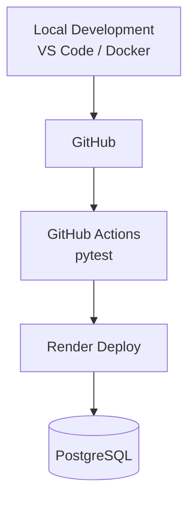

# 🍞 Bakery Sales Management System

## 📸 スクリーンショット

### 🍞 商品マスタ登録画面

[](https://raw.githubusercontent.com/tosane932/sales_data_app/main/screen01.jpg)

---

### 📝 日次売上入力

[](https://raw.githubusercontent.com/tosane932/sales_data_app/main/screen02.jpg)

---

### 📊 売上分析ダッシュボード

[](https://raw.githubusercontent.com/tosane932/sales_data_app/main/screen03.jpg)

[](https://raw.githubusercontent.com/tosane932/sales_data_app/main/screen04.jpg)

[](https://raw.githubusercontent.com/tosane932/sales_data_app/main/screen05.jpg)

### 現場の「困った」を、Pythonで「最適解」へ。

ベーカリーの売上管理をデータベースで一元管理し、  
AIによる売上分析・経営アドバイスまで支援するWebアプリケーションです。

---

## 📝 更新履歴（Changelog）

### v2.3.0（2026-07-16）

- 🆔 商品IDを基準に、既存商品の名称・価格を安全に更新
- 🛑 `is_active`による販売終了（論理削除）機能を追加
- 🧾 販売終了後も過去の売上履歴を保持
- 🗄 Flask-Migrate / Alembicで`products.is_active`を追加
- ⚡ Gemini APIの自動実行を廃止し、ボタン実行へ変更
- ☕ Gemini APIの429（日次上限・速度制限）と503（混雑）を分けて案内
- 🚀 Flask開発サーバーからGunicornによる本番起動へ変更
- 🎨 ダッシュボードの戻るボタンをほかの画面と同じサイズへ調整

### v2.2.0（2026-07-16）

- ✨ 商品マスタ編集機能を追加
- 年月切替時に対象月のマスタを自動読込
- 既存マスタの編集に対応
- UIを実際の業務フローに合わせて改善

### v2.1.0（2026-07-16）

- 📱 スマホ向けレスポンシブデザイン対応
- 🎨 商品マスタ画面をカードUIへ改善
- ✨ ボタンデザインを調整
- 📖 READMEを大幅リニューアル

### v2.0.0

- 🚀 Renderへ本番デプロイ
- 🐳 Docker対応
- 🗄 PostgreSQLへ移行
- ⚙ GitHub ActionsによるCI構築

### v1.5.0

- 🤖 Gemini APIによるAI経営アドバイス追加
- 💬 AIスタッフアシスタント追加

### v1.2.0

- 📊 Chart.jsによる売上グラフ追加
- 🏆 売上ランキング機能追加

### v1.0.0

- 🎉 初回リリース
- 商品登録
- 日次売上入力
- SQLite保存

---

## 🚀 オンラインデモ（即座に体験可能）

### [【👉 ベーカリー売上管理システム体験（Renderで稼働中）】](https://bakery-salesdata.onrender.com/)

---

## 📊 3ステップで体験する「現場の業務フロー」

**1. 当月のメニューと単価を決める（マスタ登録）**

> Webフォームから今月のメニューを登録します。登録済み商品の名称・価格の更新、新商品の追加、販売終了にも対応しています。販売終了にした商品は入力画面から非表示になりますが、過去の売上履歴は保持されます。

**2. 日次売上を入力する（日常運用）**

> その日の販売数量を入力します。必要なときだけ「今日のひとこと」ボタンを押すと、Geminiが季節や曜日に応じたメッセージを生成します。

**3. 店舗の「健康診断」を見る（データ分析・AI経営アドバイス）**

> 蓄積したデータから月別・年別の売上ランキングを可視化します。詳細な提案が必要なときだけ「詳しいアドバイスを聞く」ボタンを押し、Geminiによる経営アドバイスを生成できます。

#### ※無料プラン（Free Instance）で稼働しているため、しばらくアクセスがない場合はコンテナがスリープ状態に入ります。最初のアクセス時のみ、起動に時間がかかる場合があります。

---

## 📺 デモ動画

[](https://youtu.be/iz4r3YP3JZk?si=w9AENw1iifjlwZ7j)

※デモ動画は最新版です。

## 📖 プロジェクト概要

ベーカリー店舗の日々の売上管理から分析までを一元化するWebアプリケーションです。

商品マスタ登録、日次売上入力、PostgreSQLへのデータ保存、売上ランキングの可視化、AIによる経営アドバイス生成までを一つのシステムとして実装しました。

商品マスタは物理削除せず、販売状態を表す`is_active`で管理します。これにより、販売終了商品を通常の入力画面から除外しながら、過去の売上履歴を保持できます。

また、Gemini APIはページ表示時に自動実行せず、利用者が必要としたときだけボタンから実行します。表示速度と無料枠の消費を両方意識した設計です。

## ⚙️ 機能一覧

- ✅ 月別商品マスタ管理
- ✅ 商品IDを基準にした名称・価格の更新
- ✅ 新商品の追加
- ✅ 販売終了（論理削除）
- ✅ 販売終了後の売上履歴保持
- ✅ 日次売上入力
- ✅ PostgreSQLへの永続化
- ✅ 売上ランキング表示
- ✅ Chart.jsによる売上グラフ
- ✅ Fetch APIによる非同期更新
- ✅ ボタン実行式のAI経営アドバイス（Gemini API）
- ✅ ボタン実行式のAIスタッフアシスタント
- ✅ Gemini APIの429・503エラーハンドリング
- ✅ 年・月別売上分析
- ✅ Docker環境対応
- ✅ Gunicornによる本番起動
- ✅ AlembicによるDBマイグレーション
- ✅ GitHub Actions
- ✅ pytest

## 🛠 技術スタック

### Backend

- Python 3.12
- Flask 3.1
- SQLAlchemy
- Flask-Migrate
- Gunicorn

### Frontend

- HTML
- CSS
- JavaScript
- Fetch API
- Chart.js

### Database

- PostgreSQL
- SQLite（ローカル開発）

### AI

- Google Gemini API
- Prompt Engineering

### Infrastructure

- Docker
- Docker Compose
- Render

### CI

- GitHub Actions
- pytest

## 🚀 セットアップ手順（Docker使用）

```bash
# 1. リポジトリのクローン
git clone https://github.com/tosane932/sales_data_app.git
cd sales_data_app

# 2. 環境変数の設定
cp .env.example .env
# .envを編集してGEMINI_API_KEYを設定

# 3. 起動
docker compose up --build
```

ブラウザで`http://127.0.0.1:5000`にアクセスします。

## 🔄 開発・デプロイフロー



Render起動時には、未適用のマイグレーションを反映してからGunicornを起動します。

```text
flask db upgrade
        ↓
Gunicorn起動
        ↓
Flaskアプリ公開
```

## 🏗 システム構成

```text
Browser
    │
    ▼
Gunicorn
    │
    ▼
Flask
    │
    ├── PostgreSQL
    └── Gemini API
```

## 🗃 商品の販売終了と売上履歴

商品を画面から削除したとき、データベースの行は物理削除しません。

```text
販売中
is_active = True

販売終了
is_active = False
```

販売終了商品は商品マスタ画面・日次売上入力画面から非表示になります。一方で、`DailySales.product_id`との関連は残るため、過去のランキングや売上集計を維持できます。

## 🤖 Gemini APIの実行方針

```text
日次売上入力
└── 「今日のひとこと」を押したとき

売上分析ダッシュボード
└── 「詳しいアドバイスを聞く」を押したとき
```

ページ表示や期間変更だけではAPIを実行しません。無料枠の消費を抑え、ダッシュボードの初期表示も高速化します。

## ✅ テスト

現在は`pytest`を使用し、プロンプト生成ロジックの単体テストを実装しています。

- 販売データが正しく埋め込まれること
- AIへの指示内容が期待どおり生成されること
- 戻り値が文字列であること

今後は、商品更新・論理削除・APIエンドポイントについてもテスト対象を拡充する予定です。

## 💡 開発思想

物流現場で身についた「かもしれない運転」の考え方を、ソフトウェア開発にも取り入れています。

- Fail Fast
- 入力バリデーション
- ログ出力
- 環境変数管理
- 例外処理
- 売上履歴を壊さない論理削除
- API利用回数を抑える明示的な実行操作

## 🚧 今後の実装予定

- 在庫数管理
- 売上入力時の自動在庫減算
- 発注提案機能
- AIによる欠品予測
- 曜日・季節傾向分析
- 商品別利益分析
- 商品の販売再開機能
- DB処理・APIエンドポイントのテスト拡充