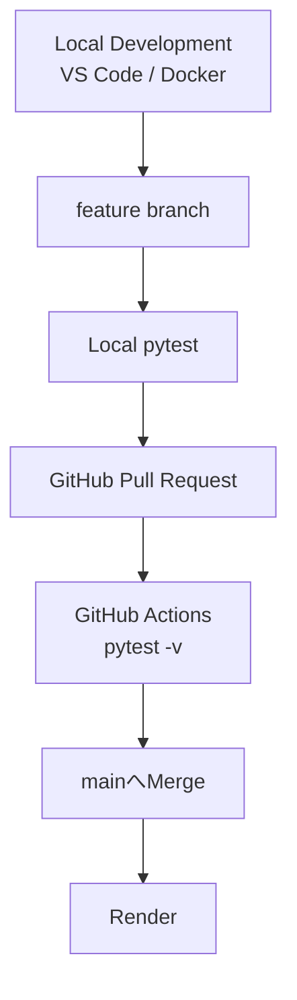

# 🍞 Bakery Sales Management System


> **現場の「困った」を、Pythonで「最適解」へ。**

ベーカリーの商品登録・日次売上入力・売上分析を一元管理し、  
Gemini APIによる経営アドバイスまで支援するWebアプリケーションです。

販売・飲食・物流の現場経験とWebデザインの知識をもとに、

**老若男女が迷わず操作でき、ヒューマンエラーを仕組みで防ぐ、現場目線の業務システム**

を目指して開発しています。

---

## 🚀 オンラインデモ

### [👉 ベーカリー売上管理システムを開く](https://bakery-salesdata.onrender.com/)

スマートフォン・PCのブラウザからアクセスできます。

> [!NOTE]
> Renderの無料インスタンスを使用しているため、しばらくアクセスがない場合はスリープ状態になります。  
> 最初のアクセス時のみ、起動に時間がかかる場合があります。

> [!IMPORTANT]
> 最新版では、Flask-Loginによる**単一管理者認証**を導入しています。  
> 認証情報はREADME上では公開していません。

> [!WARNING]
> 現在は単一管理者向けの構成で、ユーザー・店舗ごとのデータ分離は実装していません。  
> 公開環境へ個人情報や実際の店舗データを入力しないでください。

---

## 📸 スクリーンショット

> スクリーンショットは撮影時点の画面です。  
> 現在の実装では、認証・CSRF保護・アクセス制御・回帰テストなども追加しています。

### 🍞 商品マスタ登録画面

[](https://raw.githubusercontent.com/tosane932/sales_data_app/main/screenshot/screen01.jpg)

### ✅ メニュー登録完了画面

[](https://raw.githubusercontent.com/tosane932/sales_data_app/main/screenshot/screen02.jpg)

### 📝 日次売上入力画面

[](https://raw.githubusercontent.com/tosane932/sales_data_app/main/screenshot/screen03.jpg)

### 📊 売上分析ダッシュボード

[](https://raw.githubusercontent.com/tosane932/sales_data_app/main/screenshot/screen04.jpg)

[](https://raw.githubusercontent.com/tosane932/sales_data_app/main/screenshot/screen05.jpg)

[](https://raw.githubusercontent.com/tosane932/sales_data_app/main/screenshot/screen06.jpg)

---

## 📺 デモ動画

以下の画像をクリックすると、YouTubeで実際の動作を確認できます。

[](https://youtu.be/iz4r3YP3JZk?si=w9AENw1iifjlwZ7j)

> デモ動画は撮影時点の画面です。  
> 最新版では、UI・文言・画面導線に加え、認証・CSRF・アクセス制御・回帰テストも強化しています。

---

## 📖 プロジェクト概要

ベーカリー店舗の日々の商品管理・売上入力・分析を一元化するWebアプリケーションです。

現在は単一管理者ログイン後、次の業務フローで利用します。

```text
管理者ログイン
      ↓
商品メニューと価格を登録する
      ↓
本日の販売個数を入力・更新する
      ↓
売上ランキングとグラフを確認する
      ↓
必要なときだけGeminiへ経営アドバイスを依頼する
```

単に機能を実装するだけではなく、次の点を重視しています。

- 利用者が現在の登録状態を把握できる
- 操作結果を画面上の文言から理解できる
- 次の業務画面へ迷わず移動できる
- 過去の売上履歴を壊さず商品を管理できる
- 不正な入力をDB更新前に拒否する
- DB更新に失敗した場合は変更をrollbackする
- ヒューマンエラーを個人の注意力だけに頼らず仕組みで防ぐ
- 未認証ユーザーを業務画面・APIへ到達させない
- CSRF tokenなし・改ざん済みtokenによる状態変更リクエストを拒否する
- 管理者認証情報が変更された場合、既存Sessionをそのまま信用しない
- 不正な年月クエリを未処理の500エラーへ進ませない
- AIを必要なときだけ実行し、API利用回数を抑える
- pytestがGREENでも重要条件を見逃していないか、反証によって検証する

---

## ✨ 技術的な見どころ

- PostgreSQL / SQLAlchemyによる売上データの永続化
- `is_active`を用いた論理削除と過去売上履歴の保持
- `(product_id, date)`のDB一意制約による重複防止
- Flask-Migrate / Alembicによるデータベース変更管理
- 空DB・既存DB複製環境の両方でマイグレーション経路を検証
- 空DBからAlembic headまで構築できることをpytestで自動検証
- Docker / Docker Composeによる再現可能な開発環境
- Gunicorn / Renderによる本番公開
- Flask-Loginによる単一管理者認証
- Flask-WTF / CSRFProtectによるCSRF保護
- `login_required`による業務画面・APIのアクセス制御
- 匿名状態からのAI API実行防止
- 管理者password hashのfingerprintを用いた既存Sessionのfail-closed化
- 非整数の`year`・`month`クエリをHTTP 400で拒否
- pytestを**3件 → 9件 → 51件 → 69件 → 87件 → 91件**へ段階的に拡充
- Falsification（反証）の観点から既存pytestの検出力を再検証
- 代表的な11件の手動Mutation Testingを実施
- 初回SURVIVEDした5 Mutationをpytest強化後に再検証し、選択した11件すべてをKILL可能な状態へ強化
- GitHub Actionsによるpush / Pull Request時の全pytest自動実行
- feature branch → Pull Request → CI → main Mergeの変更確認フロー
- 売上・商品POSTの入力値をDB変更前に全件検証
- DB commit失敗時のrollback
- 保存型XSS・AI返答表示のXSS対策
- HTML sinkの混入を検知するXSS回帰テスト
- Jinja2 autoescapeによる初期表示経路のXSS回帰テスト
- Gemini APIの明示的な実行制御
- Gemini APIの429・503・想定外例外のfallbackをモックで回帰テスト
- 認証済みAI APIが対象年月の売上だけを利用することを検証
- 現在値の表示や文言設計による誤操作防止
- ページ別CSSスコープによるスタイルの影響範囲制御
- Flask-SQLAlchemy 3.xで非推奨となった`db.get_engine()`を廃止し、`db.engine`へ統一
- 現在のpytest結果：**91 passed, 0 warnings**

---

## 📊 3ステップで体験する業務フロー

### 1. 当月の商品メニューと価格を登録する

管理者ログイン後、トップページから現在の営業月に販売する商品名と価格を登録します。

登録済み商品については、商品IDを基準に名称・価格を更新できます。

販売終了商品は物理削除せず、`is_active`を`False`へ変更します。

商品POSTでは、保存前に次のような入力内容を検証します。

```text
配列長
商品ID
対象年月
重複ID
価格
年月
```

不正なリクエストの場合はDBを変更せず、HTTP 400で拒否します。

### 2. 本日の販売個数を入力・更新する

日次売上入力画面では、商品ごとに本日の販売個数を入力します。

すでに同日・同一商品のデータが存在する場合は、入力値を加算せず、現在値を上書き更新します。

```text
登録済み：14個
入力値　：17個

更新結果：14個 → 17個
```

商品ごとに、現在データベースへ保存されている値も表示します。

```text
高級食パン
🟢 本日の登録済み：14個
```

入力欄にも登録済みの`14`が最初から表示されます。

売上POSTでは、DB変更前に次の内容を検証します。

```text
日付
数量
配列長
商品ID
商品が存在するか
売上日と商品の対象年月が一致するか
販売終了商品ではないか
重複した商品IDが含まれていないか
```

リクエストの一部だけを保存するのではなく、不正な値が含まれている場合はリクエスト全体を拒否します。

また、同じ商品に別日の売上が存在する場合でも、対象日以外のデータを誤って更新しないことを回帰テストで確認しています。

### 3. お店の健康診断書を見る

売上分析ダッシュボードでは、次の内容を確認できます。

- 商品別売上ランキング
- 売上数量グラフ
- 年・月別集計
- 販売終了商品の過去売上
- Gemini APIによる経営改善提案

分析対象年は、現在年から過去の年だけを表示します。

また、`year`・`month`へ整数として解釈できない値が渡された場合は、未処理例外によるHTTP 500ではなくHTTP 400で拒否します。

---

## ⚙️ 主な機能

| 分類 | 機能 |
|---|---|
| 認証 | Flask-Loginによる単一管理者ログイン・認証設定fingerprintによるSession検証 |
| CSRF | Flask-WTFによる状態変更POSTのCSRF保護・改ざんtoken拒否 |
| アクセス制御 | 業務画面・APIを認証必須化 |
| 商品管理 | 月別商品登録・名称と価格の更新・新商品追加 |
| 販売終了 | `is_active`による論理削除・過去売上履歴の保持 |
| 日次売上 | 商品別販売数入力・同日データの上書き更新 |
| 入力検証 | 売上・商品POST・dashboard queryの事前validation |
| DB整合性 | `(product_id, date)`一意制約・transaction rollback |
| 状態表示 | 本日の登録済み個数・入力欄への現在値表示 |
| 売上分析 | 年月別集計・商品別ランキング・グラフ表示 |
| AI機能 | 日次支援メッセージ・経営アドバイス |
| XSS対策 | DOM API / `textContent` / `innerText` / Jinja2 autoescape |
| UI | レスポンシブ対応・操作別配色・画面導線 |
| 運用 | PostgreSQL・Docker・Render・Gunicorn |
| 品質管理 | pytest 91件・GitHub Actions・Pull Request・Falsification・手動Mutation Testing・ログ・例外処理 |

---

## 🛠 技術スタック

### Backend

- Python 3.12
- Flask 3.1
- SQLAlchemy
- Flask-Migrate
- Flask-Login
- Flask-WTF
- Werkzeug
- Gunicorn

### Frontend

- HTML
- CSS
- JavaScript
- Jinja2
- Fetch API
- Chart.js

### Database

- PostgreSQL
- SQLite（ローカル開発・テスト）

### Authentication / Security

- Flask-Login
- Flask-WTF / CSRFProtect
- Werkzeug password hash
- `login_required`
- Jinja2 autoescape
- DOM API / `textContent` / `innerText`

### AI

- Google Gemini API
- Google GenAI SDK
- Prompt Engineering

### Infrastructure / Test

- Docker
- Docker Compose
- Render
- Git / GitHub
- GitHub Pull Request
- GitHub Actions
- pytest
- Falsification
- Manual Mutation Testing

---

## 📚 詳細な設計・実装内容

以下の項目は、見出しをクリックすると展開できます。

---

<details>
<summary><strong>🔐 認証・CSRF・アクセス制御を見る</strong></summary>

<br>

### 単一管理者認証

現在は複数ユーザー方式ではなく、単一管理者方式を採用しています。

認証情報は次の環境変数から取得します。

```text
SECRET_KEY
ADMIN_USERNAME
ADMIN_PASSWORD_HASH
```

本番用の平文passwordをコード内へ固定せず、Werkzeugの`check_password_hash()`でpassword hashを検証します。

```text
GET /login
    ↓
username / passwordを入力
    ↓
password hashを照合
    ↓
成功
    ↓
認証Sessionを作成
```

現在はUser DBモデルやrole、tenant、店舗別権限は導入していません。

```text
認証済み利用者
=
単一管理者
```

という前提で運用しています。

### 認証設定変更時のSession検証

ログイン時には、現在の`ADMIN_PASSWORD_HASH`からfingerprintを生成し、Sessionへ保存します。

既存Sessionを復元するときは、

```text
現在のADMIN_PASSWORD_HASH
        ↓
fingerprint生成
        ↓
Session内のfingerprintと比較
```

を行います。

次の状態では既存Sessionをそのまま認証済みとして扱いません。

```text
fingerprintが存在しない
現在の認証設定と一致しない
ADMIN_USERNAMEが設定されていない
ADMIN_PASSWORD_HASHが有効ではない
```

そのため、管理者password hashを変更したあとも古いSessionがそのまま信用され続ける状態を防ぎます。

### CSRF保護

Flask-WTFの`CSRFProtect`をアプリ全体へ適用しています。

状態を変更するフォームにはCSRF tokenを含めます。

```html
<input
    type="hidden"
    name="csrf_token"
    value="{{ csrf_token() }}"
>
```

現在の対象は次のPOSTフォームです。

```text
POST /login
POST /
POST /input
```

CSRF tokenがないリクエストだけでなく、改ざんされたtokenもHTTP 400で拒否します。

また、拒否されたリクエストによって、

- 認証Sessionが作成されないこと
- 商品データが変更されないこと
- 売上データが変更されないこと

をpytestで確認しています。

### 業務画面・APIのアクセス制御

次のルートには`login_required`を設定しています。

```text
/
/input
/dashboard
/api/dashboard-data
/api/ai-advice
/api/greeting
```

未認証状態では業務処理へ進まず、`/login`へredirectします。

AI APIについても、匿名アクセス時にはGemini Clientへ到達しないことをpytestで確認しています。

</details>

---

<details>
<summary><strong>🧪 pytestを「事故防止台帳」として育てた記録を見る</strong></summary>

<br>

pytestは最初から91件あったわけではありません。

```text
第1段階
3件 → 9件

第2段階
9件 → 51件

第3段階
51件 → 69件

第4段階
69件 → 87件

第5段階
87件 → 91件
```

第1〜第4段階では、見つかった問題や弱い保証を回帰テストとして残してきました。

```text
ヒヤリハット発見
      ↓
原因確認
      ↓
REDテスト
      ↓
最小修正
      ↓
GREEN
      ↓
pytestへ再発防止ルールとして残す
```

第5段階では、考え方を一段進め、

```text
GREENだから安全
```

ではなく、

```text
GREENでも重要条件を見逃しているかもしれない
```

というFalsification（反証）の視点から、既存pytestそのものの検出力を検証しました。

### 第4段階：69件 → 87件

主に次の領域を強化しました。

```text
空DBからAlembic headまでのマイグレーション
dashboardの不正query
Gemini 429 / 503 / 想定外例外
認証済みAI API正常系
認証設定変更後の既存Session
改ざんCSRF token
```

空の一時SQLite DBへ、

```text
Alembic base
      ↓
upgrade
      ↓
head
```

を実行し、

- 必要なテーブル
- 必要なカラム
- Alembic revision
- `(product_id, date)`一意制約

まで自動確認する回帰テストも追加しました。

### 第5段階：87件 → 91件

第5段階では、production codeを正式に変更する前提ではなく、あえて一時的に重要条件を壊し、

```text
重要条件をMutationする
      ↓
既存pytestを実行
      ↓
REDになるか？
```

を確認しました。

代表的な11 Mutationを選択して検証した結果、

```text
初回KILLED
6件

初回SURVIVED
5件
```

となりました。

SURVIVEDした5件について原因を確認し、pytestを強化しました。

主な強化内容は次のとおりです。

```text
AI年月フィルタ
→ 前年同月データをfixtureへ追加

認証Session
→ fingerprint欠落状態を再現

売上更新
→ 同一商品の別日データをfixtureへ追加

XSS
→ 安全なDOM APIの存在だけでなくHTML sinkの混入を検知

初期ランキング表示
→ Jinja2 autoescapeが実際のHTML表示経路で有効か確認
```

その後、同じMutationを再適用してREDを確認し、

```text
選択した11 Mutation
↓
すべてKILLED可能
```

な状態へ強化しました。

> [!NOTE]
> これはアプリ全体へ自動Mutation Testingを実行し、Mutation Score 100%を達成したという意味ではありません。  
> 第5段階では、重要な仕様を代表する11件を手動で選択して反証しています。

### 現在の主なテスト領域

```text
プロンプト生成
AI連携（モック）
AIエラーfallback
AI年月フィルタ
XSS回帰
商品POST
売上POST
DB一意制約
rollback
論理削除・履歴保持
dashboard API集計
dashboard query validation
認証
Session fingerprint
CSRF
アクセス制御
Alembic migration
```

現在の結果は、

```text
91 passed, 0 warnings
```

です。

GitHub Actionsでも同じ`pytest -v`を実行します。

</details>

---

<details>
<summary><strong>🛡️ 保存型XSS対策を見る</strong></summary>

<br>

Codexによるリポジトリレビューで、動的ランキング表示やAI返答表示にHTMLとして解釈される可能性のある処理が残っていることを確認しました。

### 動的ランキング

文字列からHTMLを組み立てる方法を避け、

- `document.createElement()`
- `textContent`
- `createTextNode()`
- `replaceChildren()`

などのDOM APIを利用しています。

第5段階では、

```text
textContentが存在する
```

ことだけではなく、

```text
innerHTML
outerHTML
insertAdjacentHTML
```

など、未信頼データをHTMLとして解釈し得る処理が商品名表示へ混入した場合に検知できるsource guardも追加しました。

### 初期ランキング表示

JavaScriptによる更新後の表示だけでなく、Jinja2による初期HTML表示についても確認しています。

HTML風の商品名を実際にDBへ保存し、

```text
<em>HTML風商品名</em>
```

がHTML要素として解釈されず、文字列として表示されることをpytestで確認しています。

### AI返答

AI返答表示では、`innerHTML`ではなく`innerText`を使用します。

```javascript
function setTextWithLineBreaks(element, value) {
    element.innerText = String(value ?? '');
}
```

HTML風の文字列が返ってきてもHTML要素として解釈されないことを、XSS回帰テストでも確認しています。

</details>

---

<details>
<summary><strong>🎨 UI設計方針を見る</strong></summary>

<br>

本アプリでは、操作の種類ごとにボタンの色を固定しています。

| 操作 | 配色イメージ | 役割 |
|---|---|---|
| 商品メニュー登録 | ピスタチオグリーン | 商品情報の登録 |
| 日次売上入力・更新 | はちみつ色 | 毎日の数量入力 |
| 売上分析 | いちご色 | ランキング・分析画面への移動 |
| AIへの質問 | 淡いクリーム色 | AI機能の実行 |
| トップへ戻る | 白 | 前の業務階層へ戻る |

色は、操作を見つけやすくするための補助として使用しています。

色だけで意味を伝えず、次の要素を組み合わせています。

- アイコン
- 具体的なボタン文言
- ボタンの形
- 配置場所
- 画面間で統一された役割

### CSSの外部ファイル化

各HTMLファイル内に書かれていたCSSを、`static/style.css`へ分離しました。

```text
sales_data_app/
├── app.py
├── templates/
│   ├── index.html
│   ├── input.html
│   ├── dashboard.html
│   ├── login.html
│   └── success.html
└── static/
    └── style.css
```

ページごとに`body`クラスを設定し、ページ専用CSSの影響範囲を制御しています。

```css
.input-page .btn-submit {
    /* 日次売上入力ページだけに適用 */
}
```

```css
.dashboard-page .btn-submit {
    /* ダッシュボードだけに適用 */
}
```

共通スタイルとページ専用スタイルを分け、別画面へ意図しないスタイル変更が波及しにくい構成を目指しています。

</details>

---

<details>
<summary><strong>💡 「保存」と「更新」を区別した理由を見る</strong></summary>

<br>

バックエンドでは、同じ日付・同じ商品の売上がすでに存在する場合、入力値で上書きします。

現在は、POSTされた商品を先に検証してからDB更新処理へ進みます。

```python
for product, qty_int in validated_product_sales:
    existing = DailySales.query.filter_by(
        product_id=product.id,
        date=sale_date
    ).first()

    if existing:
        existing.quantity = qty_int
    else:
        sale = DailySales(
            product_id=product.id,
            date=sale_date,
            quantity=qty_int
        )
        db.session.add(sale)
```

たとえば、14個が登録されている商品へ17個を入力した場合、

```text
14個 → 17個
```

となります。

次の加算方式ではありません。

```text
14個 + 17個 = 31個
```

そこで画面上のボタンも、

```text
💾 保存する
```

ではなく、

```text
💾 本日の売上個数を更新する
```

としています。

成功メッセージも、

```text
✅ 本日の売上個数を更新しました！
```

とし、内部処理と利用者へ伝える文言を一致させています。

</details>

---

<details>
<summary><strong>🟢 本日の登録済み個数を表示する仕組みを見る</strong></summary>

<br>

日次売上入力画面を再度開いたときに、

```text
今日、この商品はもう入力しただろうか？
現在何個で登録されているのだろうか？
入力した数字は追加されるのだろうか？
```

と迷わないよう、現在の登録状態を表示しています。

指定日の商品別売上数を辞書へ変換します。

```python
def _get_today_sales_map(target_date):
    sales = DailySales.query.filter_by(date=target_date).all()

    return {
        sale.product_id: sale.quantity
        for sale in sales
    }
```

テンプレートでは商品ごとに登録済み数を表示します。

```html
<span class="registered-quantity">
    🟢 本日の登録済み：
    {{ today_sales.get(product.id, 0) }}個
</span>
```

入力欄にも同じ現在値を設定します。

```html
<input
    type="number"
    name="quantity"
    class="qty-input"
    min="0"
    value="{{ today_sales.get(product.id, 0) }}"
    required
>
```

登録データがない場合は`0`を表示します。

</details>

---

<details>
<summary><strong>🗃 商品の論理削除と売上履歴の保持を見る</strong></summary>

<br>

商品を画面から削除した場合も、データベースの行は物理削除しません。

```text
販売中
is_active = True

販売終了
is_active = False
```

販売終了商品は通常の商品マスタ画面・日次売上入力画面から非表示になります。

一方で`DailySales.product_id`との関連は維持されるため、

- 過去の販売数量
- 過去の商品別ランキング
- 年・月別集計
- 販売終了前の売上履歴

を保持できます。

既存商品は商品名ではなく商品IDを基準に扱います。

そのため商品名を変更した場合でも、同じProduct IDと過去のDailySalesとの関連を維持できます。

### DB側でも重複を防ぐ

`DailySales`では、

```text
(product_id, date)
```

の組み合わせへ一意制約を設定しています。

アプリ側のチェックだけでなく、DB側でも同一商品・同一日の重複レコードを防ぎます。

</details>

---

<details>
<summary><strong>🗄 マイグレーションと空DB構築の検証を見る</strong></summary>

<br>

Flask-Migrate / Alembicを導入したあと、途中からマイグレーション履歴を作成した影響で、

```text
空のDB
↓
flask db upgrade
↓
productsテーブルが存在しない
```

という問題が見つかりました。

そこで、

```text
products
daily_sales
```

を作成する基礎revisionを追加し、既存revisionへ接続しました。

### PostgreSQLでの手動検証

通常の開発DBを直接使わず、隔離したPostgreSQL環境を用意しています。

```text
空PostgreSQL
↓
flask db upgrade
↓
Gunicorn起動
↓
HTTP 200確認
```

さらに既存DBについては、

```text
既存DB
↓
読み取り専用でpg_dump
↓
隔離PostgreSQLへ復元
↓
upgrade
↓
schema / data確認
```

という経路でも確認しました。

`(product_id, date)`一意制約追加時にも、

```text
upgrade
↓
downgrade
↓
再upgrade
```

を隔離環境で検証しています。

### pytestによる自動回帰テスト

第4段階では、マイグレーション履歴そのものが壊れていないことを継続的に確認するため、

```text
一時SQLite DB
↓
Alembic base
↓
upgrade
↓
head
```

という経路をpytestへ追加しました。

最終状態で、

- `products`
- `daily_sales`
- 必要なカラム
- Alembic head
- `daily_sales(product_id, date)`の複合一意制約

が存在することを確認します。

これにより、

```text
アプリが動く
```

だけではなく、

```text
新しい空DBをマイグレーション履歴だけから構築できる
```

ことも回帰テストとして残しています。

</details>

---

<details>
<summary><strong>🤖 Gemini APIの実行方針を見る</strong></summary>

<br>

Gemini APIは、ページを表示しただけでは自動実行しません。

```text
日次売上入力画面
└── 「今日のひとことを聞く」を押したとき

売上分析ダッシュボード
└── 「詳しいアドバイスを聞く」を押したとき
```

利用者が必要としたときだけAPIを実行することで、

- 無料枠の消費を抑える
- 初期表示を高速化する
- 意図しないAPI呼び出しを減らす
- 実行タイミングを利用者へ明示する
- エラーが発生した操作を把握しやすくする

ことを狙っています。

さらに現在はAI API自体も認証必須にしており、匿名ユーザーからGemini処理へ到達しないようにしています。

### 認証済みAI APIの回帰テスト

Gemini Clientをモックし、

```text
認証済み利用者
↓
/api/ai-advice
↓
指定年月の売上を抽出
↓
promptへ渡す
↓
AI返答をJSONで返す
```

というルート単位の正常系も確認しています。

第5段階では、同じ月でも前年の売上が混ざらないことを確認するため、前年同月データをfixtureへ追加しました。

```text
2026年8月
→ 対象

2025年8月
→ 対象外
```

月だけではなく、年と月の両方で正しく絞り込まれていることを検証しています。

### エラーハンドリング

Gemini APIのエラーを一律に扱わず、主に次の状態を分けて案内します。

```text
429
APIの利用上限・速度制限など

503
API側の一時的な混雑・利用不能など

その他の想定外例外
既定のfallbackメッセージ
```

429・503・想定外例外についてはGemini Clientをモックし、既定のfallback挙動が維持されていることをpytestで確認しています。

</details>

---

<details>
<summary><strong>🧭 画面導線と未来年の見直しを見る</strong></summary>

<br>

店舗業務の流れに沿って、画面間のナビゲーションを整理しました。

```text
商品メニューを登録する
        ↓
日次売上を入力する
        ↓
売上分析・ランキングを見る
```

日次売上入力画面から売上分析ダッシュボードへ移動でき、

ダッシュボードから日次入力画面・トップページへ戻れる導線を用意しています。

### 未来年の選択肢を削除

商品メニュー登録画面では、現在の営業年度を中心に扱います。

売上分析画面では、現在年から過去の年だけを表示します。

```jinja2

```

2026年の場合、

```text
2026年
2025年
2024年
2023年
```

となります。

未来の売上結果は存在しないため、利用者が迷う可能性のある不要な選択肢を表示しない方針です。

### 不正な年月query

`dashboard`・`dashboard-data`・`ai-advice`では、`year`・`month`を共通処理で整数化します。

整数として解釈できない場合は、

```text
未処理例外
↓
HTTP 500
```

へ進ませず、

```text
不正query
↓
HTTP 400
```

として拒否します。

AI APIの場合、不正queryが渡された時点でGemini Clientへ到達しないことも確認しています。

</details>

---

<details>
<summary><strong>🏗 システム構成と開発フローを見る</strong></summary>

<br>

### システム構成

```text
Browser
    │
    ▼
Gunicorn
    │
    ▼
Flask
    │
    ├── Flask-Login
    ├── CSRFProtect
    ├── SQLAlchemy
    │      │
    │      ▼
    │   PostgreSQL
    │
    └── Gemini API
```

業務画面とAPIには認証チェックが入り、

状態変更POSTにはCSRFチェックが入ります。

### 開発・変更確認フロー



pytest強化では実際に、

```text
feature/auth-hardening
↓
pytest 69 passed
↓
Pull Request #1
↓
CI成功
↓
mainへMerge
```

```text
feature/pytest-stage4
↓
pytest 87 passed, 2 warnings
↓
Pull Request #2
↓
CI成功
↓
mainへMerge
```

```text
feature/pytest-stage5
↓
pytest 91 passed, 2 known warnings
↓
Pull Request #3
↓
CI成功
↓
mainへMerge
```

さらにStage 5で可視化された既知Warningについて、

```text
fix/flask-sqlalchemy-warning
↓
db.get_engine()を削除
↓
db.engineへ統一
↓
pytest 91 passed, 0 warnings
↓
Pull Request #4
↓
mainへMerge
```

まで確認しています。

</details>

---

<details>
<summary><strong>✅ テストとCIを見る</strong></summary>

<br>

現在はpytestを**91件**まで拡充しています。

### 主なテスト対象

```text
test_prompts.py
→ Geminiへ渡すプロンプトの契約

test_ai_integration.py
→ Gemini ClientをモックしたAI連携
→ 429 / 503 / 想定外例外
→ 認証済みAI API
→ 年月フィルタ

test_xss_regressions.py
→ XSS対策の回帰防止
→ HTML sinkの混入検知
→ Jinja2 autoescapeの初期表示検証

test_products.py
→ 商品登録・更新・validation・rollback・履歴保持

test_sales.py
→ 売上入力・validation・DB一意制約・rollback
→ 同一商品の別日売上を誤更新しないこと

test_dashboard.py
→ dashboard APIの集計
→ 不正year / month queryのHTTP 400

test_auth.py
→ ログイン・認証Session
→ 認証設定変更時のSession無効化
→ fingerprint欠落時のfail-closed

test_csrf.py
→ CSRF token
→ tokenなしPOST拒否
→ 改ざんtoken拒否
→ 拒否時に副作用がないこと

test_authorization.py
→ 匿名ユーザーから業務画面・APIへのアクセス拒否

test_migrations.py
→ 空DBからAlembic headまでのmigration
→ 必要schema・一意制約の検証
```

現在の結果は、

```text
91 passed, 0 warnings
```

です。

GitHub Actionsでは、

```text
push to main
Pull Request to main
```

の両方で、

```bash
pytest -v
```

を実行します。

### pytest強化の推移

```text
開始時
3 passed

第1段階
9 passed

第2段階
51 passed

第3段階
69 passed

第4段階
87 passed

第5段階
91 passed

Warning修正後
91 passed, 0 warnings
```

### 第3段階で追加した18件

```text
認証
5件

CSRF
6件

アクセス制御
7件
```

合計18件を追加し、

```text
51 passed
↓
69 passed
```

となりました。

### 第4段階

第4段階では、

```text
69 passed
↓
87 passed
```

へ拡充しました。

主な対象は、

- 空DB migration
- 不正dashboard query
- Gemini error fallback
- 認証済みAI API
- 認証設定変更後のSession
- 改ざんCSRF token

です。

### 第5段階

第5段階では、単にテスト件数を増やすのではなく、

**現在のGREENが重要な仕様違反を本当に検出できるのか**

を確認しました。

代表的な11 Mutationの結果は、

```text
初回KILLED
6

初回SURVIVED
5
```

でした。

SURVIVEDした5件を分析し、既存pytestのfixture・assertion・異常状態の再現方法を強化しました。

その後、同一Mutationを再適用し、

```text
選択した11 Mutation
↓
すべてREDを確認
```

しています。

第5段階の正式差分はテストコードのみで、

```text
test_ai_integration.py
test_auth.py
test_sales.py
test_xss_regressions.py
```

を強化しました。

production code・template・model・migrationには正式変更を加えていません。

テスト数そのものではなく、

**一度見つけた事故やヒヤリハットを次から自動で止めること**

そして、

**その安全装置が本当に故障を検知できるか確かめること**

を目的にしています。

</details>

---

<details>
<summary><strong>💡 開発思想を見る</strong></summary>

<br>

物流現場で身につけた「かもしれない運転」の考え方を、ソフトウェア開発にも取り入れています。

```text
「今日何個入力したか分からなくなるかもしれない」
        ↓
本日の登録済み個数を表示する

「入力値が加算されると誤解するかもしれない」
        ↓
現在値を表示し、更新であることを明記する

「不正な値が一部だけDBへ保存されるかもしれない」
        ↓
全件検証してからDB更新する

「DB commitが途中で失敗するかもしれない」
        ↓
rollbackしてtransactionを戻す

「同じ商品・同じ日のデータが重複するかもしれない」
        ↓
DBにも一意制約を設定する

「未認証ユーザーがAPIへ直接アクセスするかもしれない」
        ↓
login_requiredで業務画面・APIを保護する

「ログイン中に意図しないPOSTを送られるかもしれない」
        ↓
CSRFProtectで状態変更POSTを保護する

「CSRF tokenそのものが改ざんされるかもしれない」
        ↓
改ざんtokenを拒否し、副作用がないことをpytestで確認する

「管理者passwordを変更しても古いSessionが残るかもしれない」
        ↓
認証設定fingerprintで既存Sessionを再検証する

「同じ月でも前年の売上がAI分析へ混ざるかもしれない」
        ↓
前年同月fixtureを置いてyear条件を検証する

「同じ商品の別日の売上を誤って更新するかもしれない」
        ↓
別日データを置いてdate条件を検証する

「安全なDOM APIがあっても危険なHTML処理が混入するかもしれない」
        ↓
HTML sinkの混入をsource guardで検知する

「pytestがGREENでも重要条件を見逃しているかもしれない」
        ↓
Falsificationと手動Mutation Testingで検出力を確認する

「未来年を選んで迷うかもしれない」
        ↓
不要な選択肢を表示しない

「次の画面への移動方法が分からないかもしれない」
        ↓
業務の流れに沿ったボタンを配置する
```

主に次の考え方を重視しています。

- Fail Fast
- 入力バリデーション
- DB制約
- transaction / rollback
- ログ出力
- 環境変数管理
- 例外処理
- 認証
- fail-closed
- CSRF保護
- アクセス制御
- XSS対策
- 売上履歴を壊さない論理削除
- API利用回数を抑える明示的な実行操作
- 現在状態を利用者へ見せるUI
- 内部処理と画面上の文言を一致させる
- 色だけに依存しない操作案内
- 回帰テスト
- Falsification
- Mutation Testing
- ヒューマンエラーを仕組みで防ぐ

### 現場経験を生かした設計

開発者は以前、全国の百貨店催事場で広島風お好み焼きの調理・実演販売を経験しています。

- 商品を作る
- セールストークを考える
- 接客する
- お客様へ販売する
- 材料を発注する
- 売上を管理する
- スタッフを採用・管理する

という一連の店舗運営に携わりました。

その経験から、システムでも次の点を重視しています。

> **機能が存在するだけでなく、利用者がその意味を理解して使えること。**

Webデザインで学んだ視線誘導・配色・情報の優先順位と、販売現場で得た利用者視点を組み合わせ、老若男女が直感的に操作できる画面を目指しています。

また物流現場では、安全装置が存在するだけで事故がなくなるわけではありません。

ソフトウェアでも同様に、

```text
認証がある
CSRF対策がある
pytestがGREEN
CIが成功
```

という事実だけで思考を止めず、

**「その安全装置は、壊れたとき本当に異常を検知できるのか」**

まで確認することを重視しています。

</details>

---

<details>
<summary><strong>🚀 セットアップ手順を見る</strong></summary>

<br>

### 1. リポジトリをクローン

```bash
git clone https://github.com/tosane932/sales_data_app.git
cd sales_data_app
```

### 2. 環境変数を作成

```bash
cp .env.example .env
```

`.env`へ必要な値を設定します。

```env
GEMINI_API_KEY=your_gemini_api_key
SECRET_KEY=your_random_secret_key
ADMIN_USERNAME=your_admin_username
ADMIN_PASSWORD_HASH=your_password_hash
```

`ADMIN_PASSWORD_HASH`には平文passwordではなく、Werkzeug互換のhashを設定します。

例として、ローカル環境で次のように生成できます。

```bash
python -c "from werkzeug.security import generate_password_hash; print(generate_password_hash('your-password'))"
```

表示されたhashを`.env`の`ADMIN_PASSWORD_HASH`へ設定します。

> [!WARNING]
> `.env`にはAPIキー・SECRET_KEY・認証情報などの機密情報が含まれます。  
> GitHubなどの公開リポジトリへpushしないでください。

### 3. Docker Composeで起動

```bash
docker compose up --build
```

Docker Compose利用時は、FlaskとPostgreSQLをまとめて起動します。

```text
Docker Compose
├── Flaskコンテナ
└── PostgreSQLコンテナ
```

ブラウザから次のURLへアクセスします。

```text
http://127.0.0.1:5000
```

### Dockerを使わずローカル起動する場合

`DATABASE_URL`が設定されていない場合、現在の設定ではローカルSQLiteを使用します。

必要な依存関係をインストールしてからFlaskを起動します。

```bash
pip install -r requirements.txt
flask db upgrade
flask run
```

### Dockerを直接実行する場合

```bash
docker build -t sales-data-app .
```

```bash
docker run \
  -p 5000:5000 \
  --env-file .env \
  sales-data-app
```

> [!NOTE]
> Docker Composeでは`DATABASE_URL`をPostgreSQLコンテナへ接続する値として設定しています。  
> Dockerを単体で起動する場合は、利用するDB構成に合わせて`DATABASE_URL`を設定してください。

</details>

---

<details>
<summary><strong>📝 更新履歴を見る</strong></summary>

<br>

### 2026-08-15：Flask-SQLAlchemy Warning解消

- 🧹 `migrations/env.py`の互換処理を整理
- ⚠️ Flask-SQLAlchemy 3.xで非推奨の`db.get_engine()`を削除
- ✅ 現行APIの`db.engine`へ統一
- 🧪 テスト件数や本体機能を変更せずWarningを解消
- ✅ pytest **91 passed, 0 warnings**
- 🌿 `fix/flask-sqlalchemy-warning`で修正
- 🔍 Pull Request #4を経由してmainへMerge

### 2026-08-15：pytest強化 第5段階 / Falsification・手動Mutation Testing

- 🧪 pytestを87件から91件へ拡充
- 🔍 Falsification（反証）の観点から既存pytestの検出力を検証
- 🧬 代表的な11 Mutationを手動で適用
- ✅ 初回KILLED 6件
- ⚠️ 初回SURVIVED 5件
- 🛠 SURVIVEDした5件についてfixture・assertion・異常状態の再現方法を強化
- 🔁 同一Mutationを再適用しREDを確認
- ✅ 選択した11 MutationすべてをKILL可能な状態へ強化
- 📅 AI年月filterへ前年同月データを追加
- 🔐 fingerprint欠落Sessionのfail-closedテストを追加
- 🧾 同一商品の別日売上を誤更新しないテストを追加
- 🛡 XSS source guardと初期表示autoescapeテストを強化
- 🧪 正式変更は`test_ai_integration.py`・`test_auth.py`・`test_sales.py`・`test_xss_regressions.py`
- ✅ production code・template・model・migrationには正式変更なし
- 🌿 `feature/pytest-stage5`で実施
- 🔍 Pull Request #3を経由してmainへMerge
- ✅ Stage 5時点：pytest **91 passed, 2 known warnings**

### 2026-08-13：pytest強化 第4段階

- 🧪 pytestを69件から87件へ拡充
- 🗄 空DBからAlembic headまでupgradeするmigration回帰テストを追加
- 🧱 必要table・column・revision・複合一意制約を自動確認
- 🚫 `dashboard`・`dashboard-data`・`ai-advice`の非整数`year`・`month`をHTTP 400で拒否
- 🤖 不正query時にGemini Clientへ到達しないことを確認
- ☕ Gemini 429・503・想定外例外のfallbackをモックで回帰テスト
- 🤖 認証済み`/api/ai-advice`正常系をroute単位で検証
- 🔐 管理者認証設定fingerprintをSessionへ保存
- 🚧 管理者password hash変更後の既存Sessionをfail-closed化
- ✅ 認証設定が変わっていないSessionは正常復元
- 🛡 login・商品・売上POSTへ改ざんCSRF tokenテストを追加
- ↩️ CSRF拒否時に認証・DB変更の副作用がないことを確認
- 🌿 `feature/pytest-stage4`で実施
- 🔍 Pull Request #2を経由してmainへMerge
- ✅ pytest **87 passed, 2 warnings**

### 2026-08-11：pytest強化 第3段階

- 🔐 Flask-Loginによる単一管理者ログインを追加
- 🔑 `SECRET_KEY`・`ADMIN_USERNAME`・`ADMIN_PASSWORD_HASH`を環境変数化
- 🛡 Flask-WTF / CSRFProtectによるCSRF保護を追加
- 📝 `/login`・`/`・`/input`へCSRF tokenを追加
- 🚧 `/`・`/input`・`/dashboard`・各業務APIを認証必須化
- 🤖 匿名状態からAI APIへ到達できないことを回帰テスト化
- 🧪 認証5件・CSRF6件・アクセス制御7件を追加
- ✅ pytestを51件から69件へ拡充
- 🌿 `feature/auth-hardening`で段階的に実装
- 🔍 Pull Request #1で差分・CI結果・conflictを確認
- ✅ GitHub Actionsで69件成功後にmainへMerge
- ✅ Merge後のmainでも69件成功を確認

### 2026-08-10：pytest強化 第1・第2段階 / XSS対策

- 🧪 pytestを3件 → 9件 → 51件へ拡充
- ✅ 売上POSTのvalidationを強化
- ✅ 商品POSTのvalidationを強化
- 🗄 `(product_id, date)`へDB一意制約を追加
- ↩️ 売上・商品POSTのcommit失敗時rollbackを回帰テスト化
- 🧾 論理削除後の売上履歴保持を回帰テスト化
- 📊 dashboard APIの集計を回帰テスト化
- 🛡 動的ランキング表示の保存型XSS対策
- 🤖 AI返答表示を`innerHTML`から`innerText`へ変更

### 2026-08-06：マイグレーション修復

- 🗄 空DBから初期構築できないマイグレーション履歴を修復
- 🧱 `products`・`daily_sales`を作成する基礎revisionを追加
- 🧪 空PostgreSQLからheadまでupgradeできることを検証
- 📦 既存DB複製環境でもupgrade経路を確認

### v2.4.1（2026-07-19）

- 🗂 デモ動画・サムネイル・スクリーンショットを用途別フォルダへ整理
- 🖼 最新画面へスクリーンショットを更新し、README内の画像パスを修正
- 🔒 `.gitignore`を整理し、仮想環境・キャッシュ・機密情報・ローカルデータを除外
- 🐳 `.dockerignore`を整理し、開発資料・テスト・ローカルデータをDockerビルド対象から除外
- 🧹 旧Excel処理の設定、未使用import、`openpyxl`依存関係を削除
- 🎨 未使用CSSと古い画面タイトルを削除・修正
- ✅ 旧仕様の残骸と競合記号を検索し、当時の`pytest` 3件成功・Git作業ツリーcleanを確認

### v2.4.0（2026-07-19）

- 🎨 HTML内のCSSを`static/style.css`へ分離
- 🧩 `input-page`・`dashboard-page`・`success-page`でページ別スタイルを整理
- 📅 トップページから不要な未来年の選択肢を削除
- 📊 ダッシュボードを現在年から過去のみ選択できる仕様へ変更
- 🟢 商品ごとに本日の登録済み売上個数を表示
- 🔢 入力欄へデータベースの現在値を初期表示
- 🔄 「保存する」を「本日の売上個数を更新する」へ変更
- ✅ 更新完了メッセージを処理内容に合わせて変更
- ↔️ 商品同士の余白と区切り線を追加
- 🧭 トップ・日次入力・売上分析間の画面導線を改善
- 🎨 ボタン色を操作の役割ごとに統一
- 📱 スマートフォン表示を再調整

### v2.3.0（2026-07-16）

- 🆔 商品IDを基準に既存商品の名称・価格を更新
- 🛑 `is_active`による販売終了機能を追加
- 🧾 販売終了後も過去の売上履歴を保持
- 🗄 Flask-Migrate / Alembicで`products.is_active`を追加
- ⚡ Gemini APIの自動実行を廃止し、ボタン実行へ変更
- ☕ Gemini APIの429と503を分けて案内
- 🚀 Flask開発サーバーからGunicornによる本番起動へ変更

### v2.2.0（2026-07-16）

- ✨ 商品マスタ編集機能を追加
- 年月切替時に対象月の商品マスタを自動読込
- 既存商品の編集に対応
- UIを実際の業務フローに合わせて改善

### v2.1.0（2026-07-16）

- 📱 スマートフォン向けレスポンシブデザイン対応
- 🎨 商品マスタ画面をカードUIへ改善
- ✨ ボタンデザインを調整
- 📖 READMEを大幅リニューアル

### v2.0.0

- 🚀 Renderへ本番デプロイ
- 🐳 Docker対応
- 🗄 PostgreSQLへ移行
- ⚙ GitHub ActionsによるCI構築

### v1.5.0

- 🤖 Gemini APIによるAI経営アドバイス追加
- 💬 AIスタッフアシスタント追加

### v1.2.0

- 📊 Chart.jsによる売上グラフ追加
- 🏆 売上ランキング機能追加

### v1.0.0

- 🎉 初回リリース
- 商品登録
- 日次売上入力
- SQLite保存

</details>

---

## 🚧 今後の改善候補

### 認証・セキュリティ

- logout機能とSession終了テスト
- 認証設定不足時のfail-closed専用テスト拡充
- Session Cookie設定の強化
- ログイン試行へのrate limit
- APIの認証切れ時に302ではなく401 JSONを返す設計の検討

### ユーザー・データ管理

- 複数ユーザー対応
- Userモデル
- role設計
- ユーザー・店舗ごとのデータ分離
- 所有者確認
- 公開デモデータの初期化機能
- 公開環境における削除操作の制限
- 更新前後の売上履歴

### 店舗業務支援

- 在庫数管理
- 売上入力時の自動在庫減算
- 発注提案機能
- AIによる欠品予測
- 曜日・季節傾向分析
- 商品別利益分析
- 原価・材料コスト管理
- 商品の販売再開機能

### コード・品質改善

- JavaScriptの外部ファイル化
- CSSのページ別ファイル分割
- `month=13`など整数ではあるが範囲外の年月に対する仕様整理
- 同数ランキング時の並び順仕様決定
- 商品名最大長・年範囲など未確定仕様の整理
- `login_required`と内部認証チェックの重複整理
- PostgreSQL固有挙動を対象とした自動テスト拡充
- 同時POST・concurrency時の整合性検証
- 実ブラウザを用いたE2Eテストの検討
- 自動Mutation Testingツール導入とMutation Score計測の検討

---

## 🔗 関連リンク

- [Qiita：開発記録・エラー解決記事](https://qiita.com/tosane932)
- [オンラインデモ](https://bakery-salesdata.onrender.com/)
- [GitHubリポジトリ](https://github.com/tosane932/sales_data_app)
- [商品を消しても売上履歴を壊さない論理削除の実装記録](https://qiita.com/tosane932/items/4825452f4bb73fd90ba8)
- [Flask-Migrateの初期マイグレーション修復記録](https://qiita.com/tosane932/items/13c2ca0e17716594aa1e)

### pytest強化シリーズ

- [pytestを「事故防止台帳」として育てる 第1段階](https://qiita.com/tosane932/items/f3de1e190873a90de39f)
- [pytestを「事故防止台帳」として育てる 第2段階](https://qiita.com/tosane932/items/b91261e7103df5792f7d)
- [pytestを「事故防止台帳」として育てる 第3段階](https://qiita.com/tosane932/items/6d1ca5490979c8cf9d62)
- [pytestを「事故防止台帳」として育てる 第4段階](https://qiita.com/tosane932/items/372270330e73583a227f)
- [pytestを「事故防止台帳」として育てる 第5段階](https://qiita.com/tosane932/items/85fd24c7baa6fe7c76a7)