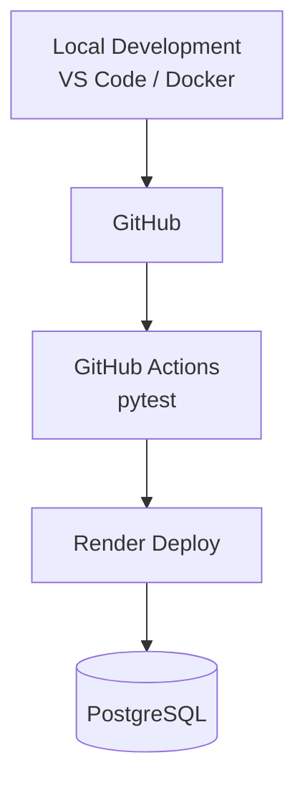

# 🍞 Bakery Sales Management System

> 現場の「困った」を、Pythonで「最適解」へ。

ベーカリーの商品登録・日次売上入力・売上分析を一元管理し、  
Gemini APIによる経営アドバイスまで支援するWebアプリケーションです。

販売・飲食・物流の現場経験とWebデザインの知識をもとに、  
**老若男女が迷わず操作できる、現場目線の業務システム**を目指して開発しています。

---

## 🚀 オンラインデモ

### [👉 ベーカリー売上管理システムを体験する](https://bakery-salesdata.onrender.com/)

スマートフォン・PCのブラウザから利用できます。

> [!NOTE]
> Renderの無料インスタンスを使用しているため、しばらくアクセスがない場合はスリープ状態になります。  
> 最初のアクセス時のみ、起動に時間がかかる場合があります。

> [!WARNING]
> 現在のデモ環境にはユーザー認証および店舗ごとのデータ分離を実装していません。  
> 入力されたデータは同じ公開環境を利用するユーザー間で共有される可能性があります。  
> 個人情報や実際の店舗データは入力しないでください。

---

## 📸 スクリーンショット

### 🍞 商品マスタ登録画面

[](https://raw.githubusercontent.com/tosane932/sales_data_app/main/screen01.jpg)

---

### 📝 日次売上入力画面

[](https://raw.githubusercontent.com/tosane932/sales_data_app/main/screen02.jpg)

---

### 📊 売上分析ダッシュボード

[](https://raw.githubusercontent.com/tosane932/sales_data_app/main/screen03.jpg)

[](https://raw.githubusercontent.com/tosane932/sales_data_app/main/screen04.jpg)

[](https://raw.githubusercontent.com/tosane932/sales_data_app/main/screen05.jpg)

---

## 📺 デモ動画

以下の画像をクリックすると、YouTubeで実際の動作を確認できます。

[](https://youtu.be/iz4r3YP3JZk?si=w9AENw1iifjlwZ7j)

> デモ動画は撮影時点の画面です。  
> 最新版ではUI・文言・画面導線をさらに改善しています。

---

## 📖 プロジェクト概要

ベーカリー店舗の日々の売上管理から分析までを一元化するWebアプリケーションです。

次の機能を一つのシステムとして実装しています。

- 月ごとの商品メニューと価格の登録
- 登録済み商品の名称・価格の更新
- 販売終了商品の論理削除
- 商品ごとの日次売上入力
- PostgreSQLへのデータ保存
- 売上ランキングの表示
- Chart.jsによるグラフ表示
- Gemini APIによるAI経営アドバイス
- Gemini APIによる日次入力支援メッセージ

単に機能を実装するだけではなく、

- 利用者が現在の状態を把握できる
- 操作結果を文言から理解できる
- 次の業務画面へ迷わず移動できる
- ヒューマンエラーを注意力だけに頼らず防ぐ

という、実際の店舗運用を意識した設計を進めています。

---

## 📊 3ステップで体験する業務フロー

### 1. 当月の商品メニューと価格を登録する

トップページから、現在の営業月に販売する商品名と価格を登録します。

登録済み商品については、商品IDを基準に名称・価格を更新できます。

販売を終了した商品は物理削除せず、`is_active`を`False`に変更します。

---

### 2. 本日の販売個数を入力・更新する

日次売上入力画面では、商品ごとに本日の販売個数を入力します。

すでに同日・同一商品のデータが存在する場合は、入力値を加算せず、現在値を上書き更新します。

```text
登録済み：14個
入力値　：17個

更新結果：14個 → 17個
```

日次入力画面には、データベースに保存されている現在値を表示します。

```text
高級食パン
🟢 本日の登録済み：14個
```

入力欄にも登録済みの`14`が最初から表示されます。

これにより、

- 今日すでに入力したか
- 現在何個で登録されているか
- 入力後に加算されるのか、上書きされるのか

を画面上で判断できます。

---

### 3. お店の健康診断書を見る

ダッシュボードでは、指定した年・月のデータをもとに次の内容を確認できます。

- 商品別売上ランキング
- 売上数量グラフ
- 月別・年別集計
- Gemini APIによる改善提案

分析対象年は、現在年から過去の年だけを表示します。

未来の売上結果は存在しないため、未来年を選択肢に含めない設計へ変更しました。

---

## ⚙️ 主な機能

### 商品マスタ管理

- ✅ 月別商品マスタ登録
- ✅ 商品IDを基準にした名称・価格の更新
- ✅ 新商品の追加
- ✅ `is_active`による販売終了
- ✅ 販売終了後の売上履歴保持

### 日次売上管理

- ✅ 商品別の販売数量入力
- ✅ 同一日・同一商品の上書き更新
- ✅ 本日の登録済み個数を画面へ表示
- ✅ 入力欄へ現在値を初期表示
- ✅ 負数入力の防止
- ✅ 更新完了メッセージの表示

### 売上分析

- ✅ 年・月別売上分析
- ✅ 商品別売上ランキング
- ✅ Chart.jsによる売上グラフ
- ✅ 過去から現在までの分析年選択
- ✅ 販売終了商品を含む過去データの保持

### AI機能

- ✅ Gemini APIによるAI経営アドバイス
- ✅ 季節・曜日を考慮した日次入力支援メッセージ
- ✅ 利用者がボタンを押したときだけAPIを実行
- ✅ 429・503エラーの個別案内
- ✅ 無料枠と表示速度を意識した実行制御

### UI・操作性

- ✅ スマートフォン対応
- ✅ HTML内のCSSを`static/style.css`へ分離
- ✅ ページ専用クラスによるCSSの影響範囲制御
- ✅ 商品ごとの余白・区切り線を追加
- ✅ 画面間のナビゲーションを改善
- ✅ ボタンの役割ごとに配色を統一
- ✅ 色だけでなく、アイコンと具体的な文言を併用

### 開発・運用

- ✅ PostgreSQLへの永続化
- ✅ SQLiteによるローカル開発
- ✅ Docker / Docker Compose
- ✅ Flask-Migrate / Alembic
- ✅ Gunicornによる本番起動
- ✅ Renderへのデプロイ
- ✅ pytest
- ✅ GitHub Actions

---

## 🎨 UI設計方針

本アプリでは、操作の種類ごとにボタンの色を固定しています。

| 操作 | 配色イメージ | 役割 |
|---|---|---|
| 商品メニュー登録 | ピスタチオグリーン | 商品情報の登録 |
| 日次売上入力・更新 | はちみつ色 | 毎日の数量入力 |
| 売上分析 | いちご色 | ランキング・分析画面への移動 |
| AIへの質問 | 淡いクリーム色 | AI機能の実行 |
| トップへ戻る | 白 | 前の業務階層へ戻る |

色は操作を見つけやすくするための補助として使用しています。

色だけで意味を伝えず、

- アイコン
- 具体的なボタン文言
- ボタンの形
- 配置場所

を組み合わせています。

---

## 💡 「保存」と「更新」を区別した理由

バックエンドでは、同じ日付・同じ商品の売上がすでに存在する場合、入力値で上書きしていました。

```python
existing = DailySales.query.filter_by(
    product_id=int(product_id),
    date=sale_date
).first()

if existing:
    existing.quantity = qty_int
else:
    sale = DailySales(
        product_id=int(product_id),
        date=sale_date,
        quantity=qty_int
    )
    db.session.add(sale)
```

しかし、画面上のボタンは以前まで次の文言でした。

```text
💾 保存する
```

「保存する」だけでは、利用者は次のどちらか判断できません。

- 入力値を追加する
- 現在値を入力値へ置き換える

そこで、処理内容と画面上の説明を一致させました。

```text
💾 本日の売上個数を更新する
```

成功メッセージも変更しています。

```text
✅ 本日の売上個数を更新しました！
```

内部処理が正しくても、その意味が画面から伝わらなければ、実際の業務では誤操作につながる可能性があります。

---

## 🗃 商品の販売終了と売上履歴

商品を画面から削除した場合も、データベースの行は物理削除しません。

```text
販売中
is_active = True

販売終了
is_active = False
```

販売終了商品は、通常の商品登録画面・日次入力画面から非表示になります。

一方で、`DailySales.product_id`との関連は維持されるため、過去の売上履歴やランキングを壊しません。

---

## 🤖 Gemini APIの実行方針

Gemini APIはページ表示時に自動実行しません。

```text
日次売上入力画面
└── 「今日のひとことを聞く」を押したとき

売上分析ダッシュボード
└── 「詳しいアドバイスを聞く」を押したとき
```

利用者が必要としたときだけAPIを実行することで、

- 無料枠の消費を抑える
- 初期表示を高速化する
- 意図しないAPI呼び出しを防ぐ
- エラー発生箇所を把握しやすくする

ことを目指しています。

---

## 🛠 技術スタック

### Backend

- Python 3.12
- Flask 3.1
- SQLAlchemy
- Flask-Migrate
- Gunicorn

### Frontend

- HTML
- CSS
- JavaScript
- Fetch API
- Chart.js
- Jinja2

### Database

- PostgreSQL
- SQLite（ローカル開発）

### AI

- Google Gemini API
- Prompt Engineering

### Infrastructure

- Docker
- Docker Compose
- Render

### CI / Test

- GitHub Actions
- pytest

---

## 🏗 システム構成

```text
Browser
    │
    ▼
Gunicorn
    │
    ▼
Flask
    │
    ├── PostgreSQL
    │
    └── Gemini API
```

---

## 🔄 開発・デプロイフロー



Render起動時には、未適用のマイグレーションを反映してからGunicornを起動します。

```text
flask db upgrade
        ↓
Gunicorn起動
        ↓
Flaskアプリ公開
```

---

## 🚀 セットアップ手順

### 1. リポジトリをクローン

```bash
git clone https://github.com/tosane932/sales_data_app.git
cd sales_data_app
```

### 2. 環境変数を作成

```bash
cp .env.example .env
```

`.env`へ必要な値を設定します。

```env
GEMINI_API_KEY=your_gemini_api_key
```

### 3. Dockerで起動

```bash
docker compose up --build
```

ブラウザから次のURLへアクセスします。

```text
http://127.0.0.1:5000
```

---

## ✅ テスト

現在は`pytest`を使用し、プロンプト生成ロジックの単体テストを実装しています。

主な確認内容は次のとおりです。

- 販売データがプロンプトへ正しく埋め込まれること
- AIへの指示内容が含まれること
- 戻り値が文字列であること

GitHubへpushすると、GitHub Actionsでテストを実行します。

今後は次の処理もテスト対象へ追加する予定です。

- 商品更新
- 論理削除
- 売上の上書き更新
- APIエンドポイント
- ユーザー・店舗ごとのデータ分離

---

## 💡 開発思想

物流現場で身につけた「かもしれない運転」の考え方を、ソフトウェア開発にも取り入れています。

```text
「今日何個入力したか分からなくなるかもしれない」
        ↓
本日の登録済み個数を表示する

「17個を入力したら加算されると誤解するかもしれない」
        ↓
現在値を表示し、更新であることを明記する

「未来年を選んで迷うかもしれない」
        ↓
不要な選択肢を表示しない

「次の画面への移動方法が分からないかもしれない」
        ↓
各画面へ業務の流れに沿ったボタンを配置する
```

主に次の考え方を重視しています。

- Fail Fast
- 入力バリデーション
- ログ出力
- 環境変数管理
- 例外処理
- 売上履歴を壊さない論理削除
- API利用回数を抑える明示的な実行操作
- 現在状態を利用者へ見せるUI
- 曖昧な文言を避ける
- 色だけに依存しない操作案内
- ヒューマンエラーを仕組みで防ぐ

---

## 🧑‍🍳 現場経験を生かした設計

開発者は以前、百貨店の催事場で広島風お好み焼きの調理・実演販売を経験しています。

- 商品を作る
- セールストークを考える
- 接客する
- お客様へ販売する
- 材料を発注する
- 売上を管理する
- スタッフを採用・管理する

という一連の店舗運営を経験しました。

その経験から、システムでも、

> 機能が存在するだけでなく、利用者がその意味を理解して使えること

を重視しています。

Webデザインで学んだ視線誘導・配色・情報の優先順位と、販売現場で得た利用者視点を組み合わせ、老若男女が直感的に操作できる画面を目指しています。

---

## 📝 更新履歴

### v2.4.0（2026-07-19）

- 🎨 HTML内のCSSを`static/style.css`へ分離
- 🧩 `input-page`・`dashboard-page`・`success-page`でページ別スタイルを整理
- 📅 トップページから不要な未来年の選択肢を削除
- 📊 ダッシュボードを現在年から過去のみ選択できる仕様へ変更
- 🟢 商品ごとに本日の登録済み売上個数を表示
- 🔢 入力欄へデータベースの現在値を初期表示
- 🔄 「保存する」を「本日の売上個数を更新する」へ変更
- ✅ 更新完了メッセージを処理内容に合わせて変更
- ↔️ 商品同士の余白と区切り線を追加
- 🧭 トップ・日次入力・売上分析間の画面導線を改善
- 🎨 ボタン色を操作の役割ごとに統一
- 🍓 売上分析ボタンをいちご色へ変更
- 🍯 日次売上入力ボタンをはちみつ色へ統一
- 🥬 商品登録ボタンをピスタチオ色へ変更
- 🤖 AI実行ボタンを淡いクリーム色へ統一
- 📱 スマートフォン表示を再調整
- 🛠 CSS共通化による抽出ボタンの表示崩れを修正

### v2.3.0（2026-07-16）

- 🆔 商品IDを基準に、既存商品の名称・価格を安全に更新
- 🛑 `is_active`による販売終了（論理削除）機能を追加
- 🧾 販売終了後も過去の売上履歴を保持
- 🗄 Flask-Migrate / Alembicで`products.is_active`を追加
- ⚡ Gemini APIの自動実行を廃止し、ボタン実行へ変更
- ☕ Gemini APIの429と503を分けて案内
- 🚀 Flask開発サーバーからGunicornによる本番起動へ変更

### v2.2.0（2026-07-16）

- ✨ 商品マスタ編集機能を追加
- 年月切替時に対象月の商品マスタを自動読込
- 既存商品の編集に対応
- UIを実際の業務フローに合わせて改善

### v2.1.0（2026-07-16）

- 📱 スマートフォン向けレスポンシブデザイン対応
- 🎨 商品マスタ画面をカードUIへ改善
- ✨ ボタンデザインを調整
- 📖 READMEを大幅リニューアル

### v2.0.0

- 🚀 Renderへ本番デプロイ
- 🐳 Docker対応
- 🗄 PostgreSQLへ移行
- ⚙ GitHub ActionsによるCI構築

### v1.5.0

- 🤖 Gemini APIによるAI経営アドバイス追加
- 💬 AIスタッフアシスタント追加

### v1.2.0

- 📊 Chart.jsによる売上グラフ追加
- 🏆 売上ランキング機能追加

### v1.0.0

- 🎉 初回リリース
- 商品登録
- 日次売上入力
- SQLite保存

---

## 🚧 今後の実装予定

- ユーザー認証
- ユーザーまたは店舗ごとのデータ分離
- 公開デモデータの初期化機能
- 公開環境における削除操作の制限
- 更新前後の売上履歴
- 在庫数管理
- 売上入力時の自動在庫減算
- 発注提案機能
- AIによる欠品予測
- 曜日・季節傾向分析
- 商品別利益分析
- 商品の販売再開機能
- JavaScriptの外部ファイル化
- CSSのページ別ファイル分割
- DB処理・APIエンドポイントのテスト拡充

---

## 🔗 関連リンク

- [Qiita：開発記録・エラー解決記事](https://qiita.com/tosane932)
- [オンラインデモ](https://bakery-salesdata.onrender.com/)
- [GitHubリポジトリ](https://github.com/tosane932/sales_data_app)