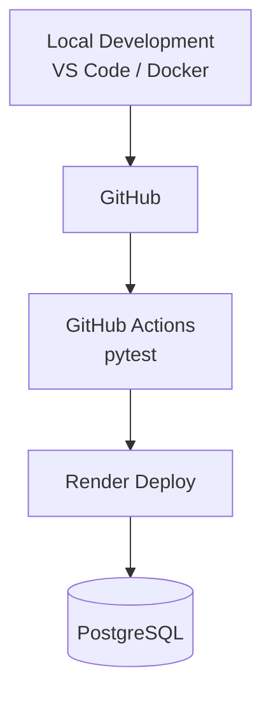

# 🍞 Bakery Sales Management System

> **現場の「困った」を、Pythonで「最適解」へ。**

ベーカリーの商品登録・日次売上入力・売上分析を一元管理し、  
Gemini APIによる経営アドバイスまで支援するWebアプリケーションです。

販売・飲食・物流の現場経験とWebデザインの知識をもとに、  
**老若男女が迷わず操作できる、現場目線の業務システム**を目指して開発しています。

---

## 🚀 オンラインデモ

### [👉 ベーカリー売上管理システムを体験する](https://bakery-salesdata.onrender.com/)

スマートフォン・PCのブラウザから利用できます。

> [!NOTE]
> Renderの無料インスタンスを使用しているため、しばらくアクセスがない場合はスリープ状態になります。  
> 最初のアクセス時のみ、起動に時間がかかる場合があります。

> [!WARNING]
> 現在のデモ環境には、ユーザー認証および店舗ごとのデータ分離を実装していません。  
> 入力されたデータは、同じ公開環境を利用するユーザー間で共有される可能性があります。  
> 個人情報や実際の店舗データは入力しないでください。

---

## 📸 スクリーンショット

### 🍞 商品マスタ登録画面

[](https://raw.githubusercontent.com/tosane932/sales_data_app/main/screenshot/screen01.jpg)

### ✅ メニュー登録完了画面

[](https://raw.githubusercontent.com/tosane932/sales_data_app/main/screenshot/screen02.jpg)

### 📝 日次売上入力画面

[](https://raw.githubusercontent.com/tosane932/sales_data_app/main/screenshot/screen03.jpg)

### 📊 売上分析ダッシュボード

[](https://raw.githubusercontent.com/tosane932/sales_data_app/main/screenshot/screen04.jpg)

[](https://raw.githubusercontent.com/tosane932/sales_data_app/main/screenshot/screen05.jpg)

[](https://raw.githubusercontent.com/tosane932/sales_data_app/main/screenshot/screen06.jpg)

---

## 📺 デモ動画

以下の画像をクリックすると、YouTubeで実際の動作を確認できます。

[](https://youtu.be/iz4r3YP3JZk?si=w9AENw1iifjlwZ7j)

> デモ動画は撮影時点の画面です。  
> 最新版では、UI・文言・画面導線をさらに改善しています。

---

## 📖 プロジェクト概要

ベーカリー店舗の日々の商品管理・売上入力・分析を一元化するWebアプリケーションです。

```text
商品メニューと価格を登録する
              ↓
本日の販売個数を入力・更新する
              ↓
売上ランキングとグラフを確認する
              ↓
Geminiから経営アドバイスを受ける
```

単に機能を実装するだけではなく、次の点を重視しています。

- 利用者が現在の登録状態を把握できる
- 操作結果を画面上の文言から理解できる
- 次の業務画面へ迷わず移動できる
- 過去の売上履歴を壊さず商品を管理できる
- ヒューマンエラーを個人の注意力だけに頼らず防ぐ
- AIを必要なときだけ実行し、API利用回数を抑える

---

## ✨ 技術的な見どころ

- PostgreSQL / SQLAlchemyによる売上データの永続化
- `is_active`を用いた論理削除と過去売上履歴の保持
- Flask-Migrate / Alembicによるデータベース変更管理
- Docker / Docker Composeによる再現可能な開発環境
- Gunicorn / Renderによる本番公開
- pytest / GitHub Actionsによる自動テストとCI
- Gemini APIの明示的な実行制御
- Gemini APIの429・503エラーハンドリング
- 現在値の表示や文言設計による誤操作防止
- ページ別CSSスコープによるスタイルの影響範囲制御

---

## 📊 3ステップで体験する業務フロー

### 1. 当月の商品メニューと価格を登録する

トップページから、現在の営業月に販売する商品名と価格を登録します。

登録済み商品については、商品IDを基準に名称・価格を更新できます。

販売終了商品は物理削除せず、`is_active`を`False`へ変更します。

### 2. 本日の販売個数を入力・更新する

日次売上入力画面では、商品ごとに本日の販売個数を入力します。

すでに同日・同一商品のデータが存在する場合は、入力値を加算せず、現在値を上書き更新します。

```text
登録済み：14個
入力値　：17個

更新結果：14個 → 17個
```

商品ごとに、現在データベースへ保存されている値も表示します。

```text
高級食パン
🟢 本日の登録済み：14個
```

入力欄にも登録済みの`14`が最初から表示されます。

### 3. お店の健康診断書を見る

売上分析ダッシュボードでは、次の内容を確認できます。

- 商品別売上ランキング
- 売上数量グラフ
- 年・月別集計
- Gemini APIによる経営改善提案

分析対象年は、現在年から過去の年だけを表示します。

---

## ⚙️ 主な機能

| 分類 | 機能 |
|---|---|
| 商品管理 | 月別商品登録・名称と価格の更新・新商品追加 |
| 販売終了 | `is_active`による論理削除・過去売上履歴の保持 |
| 日次売上 | 商品別販売数入力・同日データの上書き更新 |
| 状態表示 | 本日の登録済み個数・入力欄への現在値表示 |
| 売上分析 | 年月別集計・商品別ランキング・グラフ表示 |
| AI機能 | 日次支援メッセージ・経営アドバイス |
| UI | レスポンシブ対応・操作別配色・画面導線 |
| 運用 | PostgreSQL・Docker・Render・Gunicorn |
| 品質管理 | pytest・GitHub Actions・ログ・例外処理 |

---

## 🛠 技術スタック

### Backend

- Python 3.12
- Flask 3.1
- SQLAlchemy
- Flask-Migrate
- Gunicorn

### Frontend

- HTML
- CSS
- JavaScript
- Jinja2
- Fetch API
- Chart.js

### Database

- PostgreSQL
- SQLite（ローカル開発）

### AI

- Google Gemini API
- Prompt Engineering

### Infrastructure / Test

- Docker
- Docker Compose
- Render
- GitHub Actions
- pytest

---

## 📚 詳細な設計・実装内容

以下の項目は、見出しをクリックすると展開できます。

---

<details>
<summary><strong>🎨 UI設計方針を見る</strong></summary>

<br>

本アプリでは、操作の種類ごとにボタンの色を固定しています。

| 操作 | 配色イメージ | 役割 |
|---|---|---|
| 商品メニュー登録 | ピスタチオグリーン | 商品情報の登録 |
| 日次売上入力・更新 | はちみつ色 | 毎日の数量入力 |
| 売上分析 | いちご色 | ランキング・分析画面への移動 |
| AIへの質問 | 淡いクリーム色 | AI機能の実行 |
| トップへ戻る | 白 | 前の業務階層へ戻る |

色は、操作を見つけやすくするための補助として使用しています。

色だけで意味を伝えず、次の要素を組み合わせています。

- アイコン
- 具体的なボタン文言
- ボタンの形
- 配置場所
- 画面間で統一された役割

### CSSの外部ファイル化

各HTMLファイル内に書かれていたCSSを、`static/style.css`へ分離しました。

```text
sales_data_app/
├── app.py
├── templates/
│   ├── index.html
│   ├── input.html
│   ├── dashboard.html
│   └── success.html
└── static/
    └── style.css
```

ページごとに`body`クラスを設定しています。

```html
<body class="input-page">
```

```html
<body class="dashboard-page">
```

```html
<body class="success-page">
```

CSSではページクラスを先頭に付け、別画面への意図しない影響を抑えています。

```css
.input-page .btn-submit {
    /* 日次売上入力ページだけに適用 */
}
```

```css
.dashboard-page .btn-submit {
    /* ダッシュボードだけに適用 */
}
```

CSS整理中には、共通クラスの影響でダッシュボードの抽出ボタンから角丸が消え、黒い枠が表示される問題も発生しました。

共通スタイルとページ専用スタイルを分け、各画面を確認しながら修正しています。

</details>

---

<details>
<summary><strong>💡 「保存」と「更新」を区別した理由を見る</strong></summary>

<br>

バックエンドでは、同じ日付・同じ商品の売上がすでに存在する場合、入力値で上書きします。

```python
existing = DailySales.query.filter_by(
    product_id=int(product_id),
    date=sale_date
).first()

if existing:
    existing.quantity = qty_int
else:
    sale = DailySales(
        product_id=int(product_id),
        date=sale_date,
        quantity=qty_int
    )
    db.session.add(sale)
```

たとえば、14個が登録されている商品へ17個を入力した場合、結果は次のようになります。

```text
14個 → 17個
```

次のような加算方式ではありません。

```text
14個 + 17個 = 31個
```

しかし、以前のボタン文言は次のとおりでした。

```text
💾 保存する
```

「保存する」だけでは、利用者は次のどちらなのか判断できません。

- 入力した個数を現在値へ追加する
- 現在値を入力した個数へ置き換える

そこで、バックエンドの処理と画面上の説明を一致させました。

```text
💾 本日の売上個数を更新する
```

成功メッセージも変更しています。

```text
✅ 本日の売上個数を更新しました！
```

内部処理が正しくても、処理内容が画面から伝わらなければ、実際の業務では誤操作につながる可能性があります。

</details>

---

<details>
<summary><strong>🟢 本日の登録済み個数を表示する仕組みを見る</strong></summary>

<br>

日次売上入力画面を再度開いたときに、利用者が次のように迷う可能性がありました。

```text
今日、この商品はもう入力しただろうか？
現在何個で登録されているのだろうか？
17個を入力すると、前の値へ追加されるのだろうか？
```

そこで、指定日の商品別売上数を辞書へ変換する処理を追加しました。

```python
def _get_today_sales_map(target_date):
    sales = DailySales.query.filter_by(date=target_date).all()

    return {
        sale.product_id: sale.quantity
        for sale in sales
    }
```

テンプレートでは、商品ごとに登録済み数を表示します。

```html
<span class="registered-quantity">
    🟢 本日の登録済み：
    {{ today_sales.get(product.id, 0) }}個
</span>
```

入力欄にも同じ現在値を設定します。

```html
<input
    type="number"
    name="quantity"
    class="qty-input"
    min="0"
    value="{{ today_sales.get(product.id, 0) }}"
    required
>
```

登録データがない場合は、`get()`の第2引数によって`0`を表示します。

```jinja2
{{ today_sales.get(product.id, 0) }}
```

これにより、利用者は画面を開いた時点で現在の登録状態を確認できます。

</details>

---

<details>
<summary><strong>🗃 商品の論理削除と売上履歴の保持を見る</strong></summary>

<br>

商品を画面から削除した場合も、データベースの行は物理削除しません。

```text
販売中
is_active = True

販売終了
is_active = False
```

販売終了商品は、通常の商品マスタ画面・日次売上入力画面から非表示になります。

一方で、`DailySales.product_id`との関連は維持されるため、次のデータを保持できます。

- 過去の販売数量
- 過去の商品別ランキング
- 年・月別集計
- 販売終了前の売上履歴

商品情報を物理削除すると、関連する売上履歴や集計へ影響する可能性があります。

そのため、商品をデータベースから消すのではなく、販売状態を変更する設計を採用しました。

### 商品IDを基準に更新

既存商品は、商品名ではなく商品IDを基準に更新します。

これにより、商品名を変更した場合でも同じ商品として扱い、過去データとの関連を維持できます。

### データベース変更管理

`products`テーブルへの`is_active`追加には、Flask-Migrate / Alembicを使用しています。

```text
モデルを変更
    ↓
マイグレーションファイルを作成
    ↓
変更内容を確認
    ↓
データベースへ適用
```

Render起動時には、未適用のマイグレーションを反映してからアプリを起動します。

```text
flask db upgrade
        ↓
Gunicorn起動
        ↓
Flaskアプリ公開
```

</details>

---

<details>
<summary><strong>🤖 Gemini APIの実行方針を見る</strong></summary>

<br>

Gemini APIは、ページを表示しただけでは自動実行しません。

```text
日次売上入力画面
└── 「今日のひとことを聞く」を押したとき

売上分析ダッシュボード
└── 「詳しいアドバイスを聞く」を押したとき
```

利用者が必要としたときだけAPIを実行することで、次の効果を狙っています。

- 無料枠の消費を抑える
- 初期表示を高速化する
- 意図しないAPI呼び出しを防ぐ
- 実行タイミングを利用者へ明示する
- エラーが発生した操作を把握しやすくする

### エラーハンドリング

Gemini APIのエラーを一律に扱わず、主に次の状態を分けて案内します。

```text
429
APIの利用上限・速度制限など

503
API側の一時的な混雑・利用不能など
```

利用者には、原因に応じたメッセージを表示します。

</details>

---

<details>
<summary><strong>🧭 画面導線と未来年の見直しを見る</strong></summary>

<br>

店舗業務の流れに沿って、画面間のナビゲーションを整理しました。

```text
商品メニューを登録する
        ↓
日次売上を入力する
        ↓
売上分析・ランキングを見る
```

日次売上入力画面からは、売上分析ダッシュボードへ移動できます。

```html
<a
    href="{{ url_for('dashboard') }}"
    class="btn-submit btn-dashboard-link"
>
    📊 お店の健康診断書（売上分析・ランキング）を見る
</a>
```

ダッシュボードからは、日次入力画面とトップページへ移動できます。

```html
<div class="dashboard-actions">
    <a
        href="{{ url_for('input_sales') }}"
        class="dashboard-action dashboard-input-link"
    >
        📝 日次売上を入力する
    </a>

    <a
        href="{{ url_for('index') }}"
        class="dashboard-action dashboard-home-link"
    >
        🍞 トップページに戻る
    </a>
</div>
```

### 未来年の選択肢を削除

商品メニュー登録画面では、現在の営業年度だけを扱います。

売上分析画面では、現在年から過去の年だけを表示します。

```jinja2

```

2026年の場合は次のように表示されます。

```text
2026年
2025年
2024年
2023年
```

未来の売上結果は存在しないため、利用者が迷う可能性のある未来年を表示しない設計へ変更しました。

</details>

---

<details>
<summary><strong>🏗 システム構成とデプロイフローを見る</strong></summary>

<br>

## システム構成

```text
Browser
    │
    ▼
Gunicorn
    │
    ▼
Flask
    │
    ├── PostgreSQL
    │
    └── Gemini API
```

## 開発・デプロイフロー



ローカル環境では、Docker ComposeによってFlaskとPostgreSQLを起動できます。

```text
Docker Compose
├── Flaskコンテナ
└── PostgreSQLコンテナ
```

GitHubへpushすると、GitHub Actionsでpytestを実行します。

テスト通過後、Renderへ最新コードを反映します。

</details>

---

<details>
<summary><strong>✅ テストとCIを見る</strong></summary>

<br>

現在は`pytest`を使用し、プロンプト生成ロジックの単体テストを実装しています。

主な確認内容は次のとおりです。

- 販売データがプロンプトへ正しく埋め込まれること
- AIへの主要な指示内容が含まれること
- 戻り値が文字列であること

GitHubへpushすると、GitHub Actionsでテストを実行します。

```text
ローカルで修正
      ↓
GitHubへpush
      ↓
GitHub Actions
      ↓
pytest実行
      ↓
Renderへ反映
```

開発中には、アプリ本体のファイルとテストファイルを取り違えても、一部のテストが通過してしまう問題も経験しました。

この経験から、テストが存在するだけでは十分ではなく、重要な処理を守れるテスト設計が必要だと学びました。

今後は次の処理をテスト対象へ追加する予定です。

- 商品更新
- 論理削除
- 売上の上書き更新
- APIエンドポイント
- ユーザー・店舗ごとのデータ分離

</details>

---

<details>
<summary><strong>💡 開発思想を見る</strong></summary>

<br>

物流現場で身につけた「かもしれない運転」の考え方を、ソフトウェア開発にも取り入れています。

```text
「今日何個入力したか分からなくなるかもしれない」
        ↓
本日の登録済み個数を表示する

「17個を入力したら加算されると誤解するかもしれない」
        ↓
現在値を表示し、更新であることを明記する

「未来年を選んで迷うかもしれない」
        ↓
不要な選択肢を表示しない

「次の画面への移動方法が分からないかもしれない」
        ↓
各画面へ業務の流れに沿ったボタンを配置する
```

主に次の考え方を重視しています。

- Fail Fast
- 入力バリデーション
- ログ出力
- 環境変数管理
- 例外処理
- 売上履歴を壊さない論理削除
- API利用回数を抑える明示的な実行操作
- 現在状態を利用者へ見せるUI
- 内部処理と画面上の文言を一致させる
- 色だけに依存しない操作案内
- ヒューマンエラーを仕組みで防ぐ

### 現場経験を生かした設計

開発者は以前、全国の百貨店催事場で広島風お好み焼きの調理・実演販売を経験しています。

- 商品を作る
- セールストークを考える
- 接客する
- お客様へ販売する
- 材料を発注する
- 売上を管理する
- スタッフを採用・管理する

という一連の店舗運営に携わりました。

その経験から、システムでも次の点を重視しています。

> 機能が存在するだけでなく、利用者がその意味を理解して使えること。

Webデザインで学んだ視線誘導・配色・情報の優先順位と、販売現場で得た利用者視点を組み合わせ、老若男女が直感的に操作できる画面を目指しています。

</details>

---

<details>
<summary><strong>🚀 セットアップ手順を見る</strong></summary>

<br>

## 1. リポジトリをクローン

```bash
git clone https://github.com/tosane932/sales_data_app.git
cd sales_data_app
```

## 2. 環境変数を作成

```bash
cp .env.example .env
```

`.env`へ必要な値を設定します。

```env
GEMINI_API_KEY=your_gemini_api_key
```

> [!WARNING]
> `.env`にはAPIキーなどの機密情報が含まれます。  
> GitHubなどの公開リポジトリへpushしないでください。

## 3. Docker Composeで起動

```bash
docker compose up --build
```

ブラウザから次のURLへアクセスします。

```text
http://127.0.0.1:5000
```

### Dockerを直接実行する場合

```bash
docker build -t sales-data-app .
```

```bash
docker run \
  -p 5000:5000 \
  --env-file .env \
  sales-data-app
```

</details>

---

<details>
<summary><strong>📝 更新履歴を見る</strong></summary>

<br>

## v2.4.0（2026-07-19）

- 🎨 HTML内のCSSを`static/style.css`へ分離
- 🧩 `input-page`・`dashboard-page`・`success-page`でページ別スタイルを整理
- 📅 トップページから不要な未来年の選択肢を削除
- 📊 ダッシュボードを現在年から過去のみ選択できる仕様へ変更
- 🟢 商品ごとに本日の登録済み売上個数を表示
- 🔢 入力欄へデータベースの現在値を初期表示
- 🔄 「保存する」を「本日の売上個数を更新する」へ変更
- ✅ 更新完了メッセージを処理内容に合わせて変更
- ↔️ 商品同士の余白と区切り線を追加
- 🧭 トップ・日次入力・売上分析間の画面導線を改善
- 🎨 ボタン色を操作の役割ごとに統一
- 🍓 売上分析ボタンをいちご色へ変更
- 🍯 日次売上入力ボタンをはちみつ色へ統一
- 🥬 商品登録ボタンをピスタチオ色へ変更
- 🤖 AI実行ボタンを淡いクリーム色へ統一
- 📱 スマートフォン表示を再調整
- 🛠 CSS共通化による抽出ボタンの表示崩れを修正

## v2.3.0（2026-07-16）

- 🆔 商品IDを基準に、既存商品の名称・価格を安全に更新
- 🛑 `is_active`による販売終了機能を追加
- 🧾 販売終了後も過去の売上履歴を保持
- 🗄 Flask-Migrate / Alembicで`products.is_active`を追加
- ⚡ Gemini APIの自動実行を廃止し、ボタン実行へ変更
- ☕ Gemini APIの429と503を分けて案内
- 🚀 Flask開発サーバーからGunicornによる本番起動へ変更

## v2.2.0（2026-07-16）

- ✨ 商品マスタ編集機能を追加
- 年月切替時に対象月の商品マスタを自動読込
- 既存商品の編集に対応
- UIを実際の業務フローに合わせて改善

## v2.1.0（2026-07-16）

- 📱 スマートフォン向けレスポンシブデザイン対応
- 🎨 商品マスタ画面をカードUIへ改善
- ✨ ボタンデザインを調整
- 📖 READMEを大幅リニューアル

## v2.0.0

- 🚀 Renderへ本番デプロイ
- 🐳 Docker対応
- 🗄 PostgreSQLへ移行
- ⚙ GitHub ActionsによるCI構築

## v1.5.0

- 🤖 Gemini APIによるAI経営アドバイス追加
- 💬 AIスタッフアシスタント追加

## v1.2.0

- 📊 Chart.jsによる売上グラフ追加
- 🏆 売上ランキング機能追加

## v1.0.0

- 🎉 初回リリース
- 商品登録
- 日次売上入力
- SQLite保存

</details>

---

## 🚧 今後の実装予定

### ユーザー・データ管理

- ユーザー認証
- ユーザーまたは店舗ごとのデータ分離
- 公開デモデータの初期化機能
- 公開環境における削除操作の制限
- 更新前後の売上履歴

### 店舗業務支援

- 在庫数管理
- 売上入力時の自動在庫減算
- 発注提案機能
- AIによる欠品予測
- 曜日・季節傾向分析
- 商品別利益分析
- 商品の販売再開機能

### コード・品質改善

- JavaScriptの外部ファイル化
- CSSのページ別ファイル分割
- 商品更新・論理削除のテスト追加
- DB処理・APIエンドポイントのテスト拡充

---

## 🔗 関連リンク

- [Qiita：開発記録・エラー解決記事](https://qiita.com/tosane932)
- [オンラインデモ](https://bakery-salesdata.onrender.com/)
- [GitHubリポジトリ](https://github.com/tosane932/sales_data_app)
- [商品を消しても売上履歴を壊さない論理削除の実装記録](https://qiita.com/tosane932/items/4825452f4bb73fd90ba8)