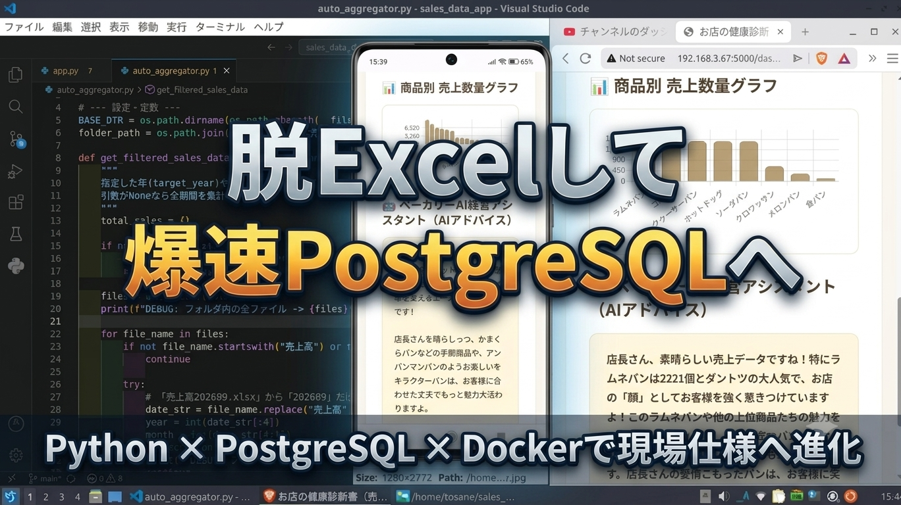

# Bakery Sales Management System

### 現場の「困った」を、Pythonで「最適解」へ。
ベーカリーの売上管理をデータベースで一元管理し、
AIによる売上分析・経営アドバイスまで支援するWebアプリケーションです。

## 🚀 オンラインデモ（即座に体験可能）
### 以下のURLから、ローカル環境の構築なしで、今すぐブラウザ上で実際のアプリケーションを体験いただけます! (スマホからでもアクセス可能です。)

### [【👉ベーカリー売上管理システム体験（Renderで稼働中）】](https://bakery-salesdata.onrender.com/)


---

## 📊 3ステップで体験する「現場の業務フロー」
初めてアプリを触る方は、ぜひ以下の流れに沿ってシステムを体験してみてください。

**1. 当月のメニューと単価を決める（マスタ登録）** 

> Webフォームから今月のメニューを登録し、データベースへ安全に積載・永続化します。

**2. 日次売上を入力する（日常運用）** 

> その日の販売数量を入力します。AI（Gemini）が季節に応じた一言で現場に寄り添います。

**3. 店舗の「健康診断」を見る（データ分析・AI経営アドバイス）** 

> 溜まったデータから月別・年別の売上ランキングを可視化し、AIが「店舗の主治医」として具体的な経営アドバイスを自動生成します。

#### ※無料プラン（Free Instance）で稼働しているため、しばらくアクセスがない場合はコンテナがスリープ状態に入ります。そのため、最初のアクセス時のみ起動（スピンアップ）に50秒ほどかかる場合がありますが、2回目以降はサクサク動きます。

---

## 📺 デモ動画
以下の画像をクリックすると、**YouTube** で実際の動作デモがご覧いただけます。

[](https://youtu.be/iz4r3YP3JZk?si=w9AENw1iifjlwZ7j)

※デモ動画は最新版です。

## 📖 プロジェクト概要

ベーカリー店舗の日々の売上管理から分析までを一元化するWebアプリケーションです。

商品マスタ登録、日次売上入力、PostgreSQLへのデータ保存、売上ランキングの可視化、AIによる経営アドバイス生成までを一つのシステムとして実装しました。

物流現場で培った「業務フローの最適化」と「かもしれない運転」の考え方を開発にも取り入れ、入力ミスや設定漏れを早期に検知できる構成を目指しています。

## ⚙️ 機能一覧

- ✅ 商品マスタ管理（商品名・価格）
- ✅ 日次売上入力
- ✅ PostgreSQLへの永続化
- ✅ 売上ランキング表示
- ✅ Chart.jsによる売上グラフ
- ✅ Fetch APIによる非同期更新
- ✅ AI経営アドバイス（Gemini API）
- ✅ AIスタッフアシスタント（季節・曜日に応じた挨拶）
- ✅ 年・月別売上分析
- ✅ Docker環境対応
- ✅ AlembicによるDBマイグレーション

## 🛠 技術スタック

### Backend
- Python
- Flask
- SQLAlchemy
- Flask-Migrate

### Frontend
- HTML
- CSS
- JavaScript
- Fetch API
- Chart.js

### Database
- PostgreSQL
- SQLite（ローカル開発）

### AI
- Google Gemini API
- Prompt Engineering

### Infrastructure
- Docker
- Docker Compose
- Render

### CI
- GitHub Actions
- pytest

## 🚀 セットアップ手順（Docker使用）

```bash
# 1. リポジトリのクローン
git clone https://github.com/tosane932/sales_data_app.git
cd sales_data_app

# 2. 環境変数の設定
cp .env.example .env
# .envを編集してGEMINI_API_KEYを設定

# 3. 起動（これだけで完了）
docker compose up --build
```

ブラウザで http://127.0.0.1:5000 にアクセス。


## 🔄 開発・デプロイフロー
[ローカル環境] (VS Code / Ubuntu)

      │
      ▼  (pytest / ローカルテスト)

[GitHub] (Push)

      │
      ▼  (GitHub Actionsで自動テスト/CI)

[Render] (自動デプロイ/CD) ───[PostgreSQL] (本番DB)


## 💡 開発思想

物流現場で身についた「かもしれない運転」の考え方をソフトウェア開発にも取り入れています。

「正常に動くだろう」ではなく、「入力ミスや設定漏れが起きるかもしれない」という前提で設計し、

- Fail Fast
- 入力バリデーション
- ログ出力
- 環境変数管理
- 例外処理

を実装しています。

## 🚧 今後の実装予定

- 在庫数管理
- 売上入力時の自動在庫減算
- 発注提案機能
- AIによる欠品予測
- 曜日・季節傾向分析
- 商品別利益分析

## 📸 スクリーンショット

### 🍞 商品マスタ登録画面

[](https://raw.githubusercontent.com/tosane932/sales_data_app/main/screen01.jpg)

---

### 📝 日次売上入力

[](https://raw.githubusercontent.com/tosane932/sales_data_app/main/screen02.jpg)

---

### 📊 売上分析ダッシュボード

[](https://raw.githubusercontent.com/tosane932/sales_data_app/main/screen03.jpg)

[](https://raw.githubusercontent.com/tosane932/sales_data_app/main/screen04.jpg)

[](https://raw.githubusercontent.com/tosane932/sales_data_app/main/screen05.jpg)
